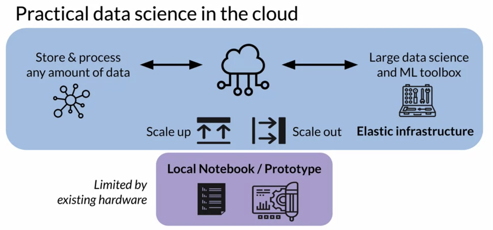
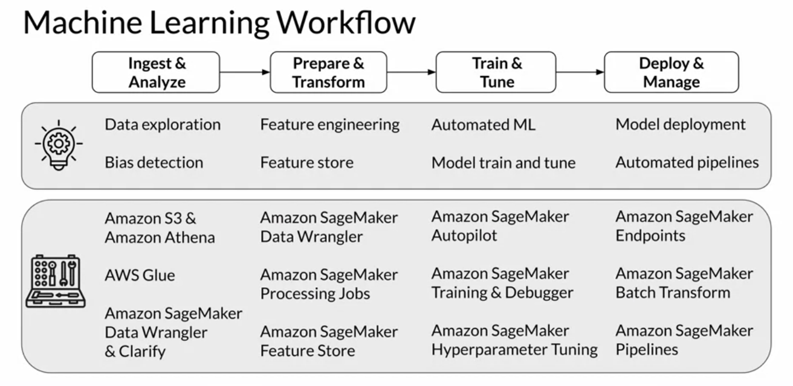

# Definitions

- Artifical Intelligence- machine mimic human behavior
- Machine Learning - static methods or algorithms that are able to learn from data
- Deep Learning - uses artificial neural networks to learn from data
- Data science -Data science truly is an interdisciplinary field that combines business and domain knowledge with mathematics, statistics, data visualization, and programming skills
- Practical data science - Practical data science helps you to improve your data science and machine learning skills, work with almost any amount of data, and implement their use cases in the most efficient way. It's different from working on a local development environment, such as your laptop, with small curated datasets. Practical data science is geared towards handling massive datasets, that could originate from social media channels, mobile and web applications, public or company internal data sources, and much more, depending on the use case you're working on.

## Limitations
- local notebook/prototype by local hardware
- unable to move and develop quickly
- consuming all compute resources

## In the cloud

- agility and elasticity
- scale up (CPU >> GPU), scale out (single >> multi-workers in seconds)
- elastic infrastructure
- store and process any amount of data
- large data science and ML toolbox

## DS and ML toolbox

- Ingest and analyze - explore and analyze data
  - S3 / Athena to ingest, store and query data
  - Glue catalog data and schema
  - Data Wrangler & clarify to analyze data
- Prepare & Transform - Feature engineering and store
  - Data Wrangler
  - Processing Jobs
  - FeatureStore
- Train & Tune - Automated ML and tune
  - Autopilot
  - debugger
  - Hyperparameter tune
- Deploy & Manage - Model deployment and pipelines
  - Endpoints
  - Batch Transform
  - Pipelines

## Use Case and Dataset

Popular ML tasks and learning paradigms
1. Classification and regression (Supervised) - assigned input to assigned class (catagorical or continuous)
2. Clustering (Unsupervised) - patterns in the data grouped/clustered 
3. Image Processing (Computer Vision) - image classification, identify segments, objects
4. Text Analysis (NLP/NLU) - natural  language processing or understanding, machine translations, sentiment analysis, etc.

# Data Ingestion and Exploration

Problem:  Imagine your e-commerce company is collecting all the customer feedback across all online channels. You need 
to capture, suddenly, customer feedback streaming from social media channels, feedback captured and transcribed through 
support center calls, incoming emails, mobile apps, and website data, and much more.

Solution: ou need a flexible and elastic repository that can start, not only the different file formats, such as dealing 
with structured data, CSV files, as well as unstructured data, such as support center call audio files. 
it also needs to elastically scale the storage capacity as new data arrives. Cloud-based data lakes address this problem.

## Data Lake

- Centralized and secure repository
- Store, discover and share data at any scale
- ingest data in its raw format without any prior data transformation
- Whether it's structured relational data in the form of CSV or TSV files, semi-structured data such as JSON or XML files, or unstructured data such as images, audio, and media files. You can also ingest streaming data, such as an application delivering a continuous feed of log files, or feeds from social media channels, into your data lake.
- Needs to be governed 
- A data lake needs to be governed. With new data arriving at any point in time you need to implement ways to discover and catalog the new data. You also need to secure and control access to the data to comply with the political data security, privacy, and governance regulations. With this governance in place, you can now give data signs and machine learning teams access to large and diverse datasets. Data lakes are often built on top of object storage, such as Amazon S3.

## Data Types

1. File storage stores and manages data as individual files organized in hierarchical file folder structures. 
2. In contrast, block storage stores and manages data as individual chunks called the blocks. And each block receives a unique identifier, but no additional metadata is stored with that block.
3. With object storage, data is stored and managed as objects, which consists of the data itself, any relevant metadata, such as when the object was last modified, and a unique identifier. Object storage is particularly helpful for storing and retrieving growing amounts of data of any type, hence it's the perfect foundation for data lakes.

And, with a data lake in place, you can now use this centralized data repository to enable data warehousing analytics and also machine learning.

## Data Wrangler

- Open source python
- Connect pandas DF and AWS services
- load / unload data from lakes, warehouses, dbs

[AWS SDK for Pandas](https://aws-sdk-pandas.readthedocs.io/en/2.19.0/about.html)

## Glue Data Catalog

- register or catalog data in S3
  - create_database
  - create_csv_table
- like an inventory for data
- Name, DB, Classification, Location 
- S3-to-table mapping
- only contains metadata  /  schema
- NO DATA IS MOVED FROM S3

[AWS Glue](https://aws.amazon.com/glue/)

### Glue crawler
- run on a schedule
- auto find ddata
- infer data schema
- updates data catalog

## Athena
- based on presto for interactive queries (open source)
- serverless (no infra setup)
- S3 SQL queries
- No data to load
- No compute limitations
- scale automatically
- splits automatically
- Lookup in data catalog
- 
[Athena](https://aws.amazon.com/athena/)

# Data Visualization

1. Pandas - data analysis and manipulation
2. NumPy - scientific computing in python
3. matplotlib - static animated and interactive visualizations
4. seaborn -  based on matplotlib and adds statistics visualizations

## Reason

Better understand data characteristics. Often SQL Queries.

