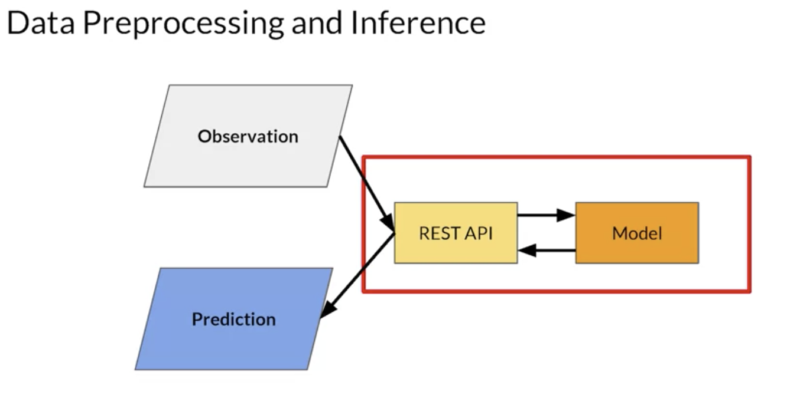
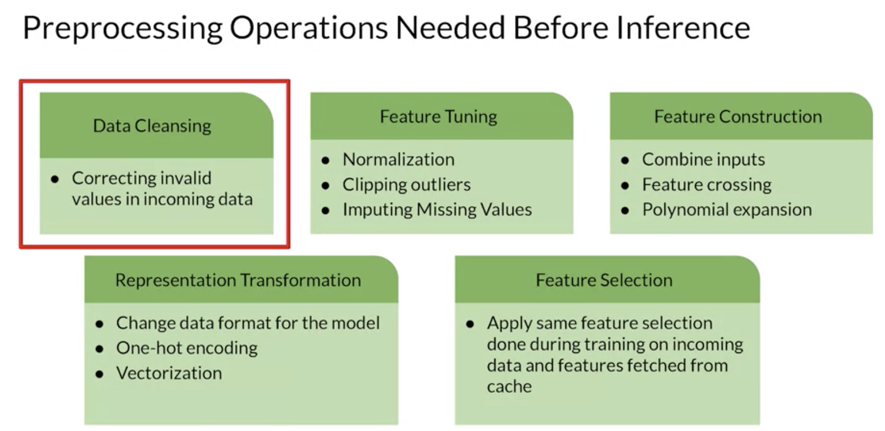
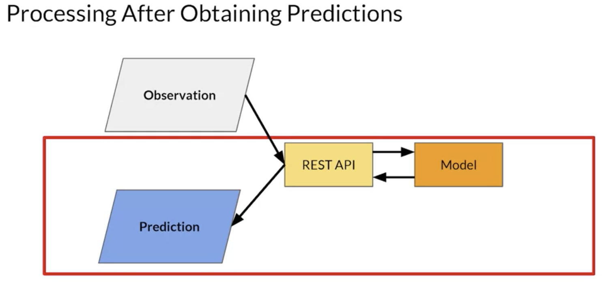

# Preprocessing

very simple high level diagram of an app, remember that the observation data being passed into the system may be in one format but that's not necessarily the same format that the model was designed to take in. The data has to be converted somehow. So, for example, consider a simple language model where maybe the observation is a sentence that the user typed and is stored as a strength. The model is designed to classify that text to see if it's toxic. NLP models like this are trained on input vectors where words are transformed into a high dimensional vector and sentences are sequences of these vectors. Now that pre processing of the data has to be done somewhere.

## Preprocessing options

# Postprocessing

## Data Cleansing
where you correct invalid values in incoming data. For example, maybe you're building an image classifier and the user sends you a picture that's invalid because it's too big. You could reject it, of course, or you could take on the process of re-sizing it to get a valid picture size.

## Feature Tuning
where you do some transformation on the data to make it suitable for the model. In the case of an image, this could be normalization where instead of us having a 32 bit value to represent a pixel, you might convert it to three 8 bit values for red, green and blue, ignoring the alpha channel. And then instead of these having values between 0 and 255, you could convert them to values between 0 and 1 as neural networks tend to deal better with normalized values like that. 

## Feature Construction
for example, might predict the price of a house, the input data might have multiple columns such as the number of rooms and the size of each, but the model is trained on the total floor space of the house. 

## Representation Transformation
- polynomial expansion where a new feature is calculated from a formula of the original feature. Maybe the data contains temperature in Celsius but the model expects Fahrenheit.

## Feature Selection

# Batch Inference Scenarios

- After you train, evaluate and tune a Machine Learning model. 
- The model is deployed to production to generate predictions. 
- An ML model can provide predictions in batches which will be applied to a use case at sometime in the future. 
- Prediction based on batch inference is when your ML model is used in a batch scoring job for a large number of data points where predictions are not required or not feasible to generate in real-time. 
- In batch recommendations, for example, you might only use historical information about customer item interactions to make the prediction without any need for real-time information. 
- Batch jobs for prediction are usually generated on some recurring schedule like daily, at night or maybe weekly.
- Predictions are usually stored in a database that can then be made available to developers or end-users.
- You can use complex machine learning models in order to improve the accuracy of your predictions since there's no constraint on inference time. 
- Also, caching of predictions like this is usually not required.
- The data retrieval can take some time if no caching strategy is employed. 
- Batch inference can also wait for data retrieval to make predictions since the predictions are not available in real-time.
- Predictions cannot be made available for real-time purposes. 
- Update latency of predictions can be hours or sometimes even days.
- Predictions are often made using old data. This is problematic in certain scenarios.
- The most important metric to optimize while performing batch predictions is throughput.
- You should always aim to increase the throughput in batch predictions rather than the latency. 
- As throughput increases the latency with which each prediction is generated increases also. 
- Throughput of an ML model or Production System processing data in batches can be increased by usage of hardware accelerators like GPUs, TPUs and all that. 
- You can also increase the number of servers or workers in which the model is deployed. 
- You can load several instances of the models and multiple workers to increase the throughput.You can load several instances of the models and multiple workers to increase the throughput.

## Use Cases
- new product recommendations on an e-commerce site can be generated on a recurring schedule.
  - caching these predictions for easy retrieval rather than generating them every time you use a logs in makes it much easier.
- sentiment analysis problem, Based on the users reviews, usually in text format, you might want to predict if a review was positive, neutral or negative. 
  - A CNN, RNN or LSTM based approach can be used for sentiment analysis. I tend to like LSTM. These models are more complex but they often provide higher accuracy. 
- forecasting demand for products or services, estimate the demand for your products perhaps on a daily basis for inventory and ordering optimization
  -  It can be modeled as a time series problem since you're predicting future demand based on historical data. Since batch predictions have minimal latency constraints, time series models like AROMA, SARIMA or an RNN can be used over approaches like linear regression for more accurate prediction.

## Batch Processing with ETL
- batch processing with data read in as stream
- Data can be of different types based on the source. 
- Large volumes of batch data are available in data lakes from CSV files, log files, etc. Streaming data, on the other hand, arrives in real-time. 
- Before data is used for making batch predictions, it has to be extracted from the multiple sources like the log files and the CSV files we spoke about, but it could also be APIs, other apps, streaming sources, and all that kind of thing.
- The extracted data should be transformed so as to make ML predictions and then load it into a database from where it can be sent in batches for prediction.
- The entire pipeline that prepares data is known as an ETL pipeline. ETL stands for extract, transform and load.
  - set of processes for extracting data from data sources, then transforming the data, and then loading the data into an output destination like a data warehouse from where it might be used for multiple purposes, encoding, running batch predictions, performing other analytics, doing data mining, and all that good stuff.
- Extraction from data sources and transformation on data can be performed in a distributed manner. Data is split into chunks and then can be parallel processed by multiple workers.
- The results of the ETL workflow are stored in a database and the results are a lower latency and higher throughput of data processing
- batch processing of data in ETL pipelines before they're sent for inference.
  - Data can come from multiple sources, like CSV files, XML files, JSON, APIs, or data lakes like Google Cloud Storage. 
  - The ETL on data is performed by engines like Apache Spark or Google Cloud Dataflow, making use of the Apache Beam programming paradigm.
  - The transformed data is stored into data warehouses like BigQuery and can be sent back into a data lake like Google Cloud Storage, before it's sent for batch prediction.
  - Continuously updating data sources like sensors can be connected to Apache Kafka, Google Cloud Pub/Sub, and products like these.
  - Cloud Dataflow using Apache Beam can perform ETL on streaming data also.
  - Spark has a product specifically for processing streaming data and Apache Kafka can also act as an ETL engine for streaming data. 
  - his data may in turn be collected into a data warehouse like BigQuery or into a data mart or a data lake. It can also serve as a source for streaming data to another pipeline. 
  - 