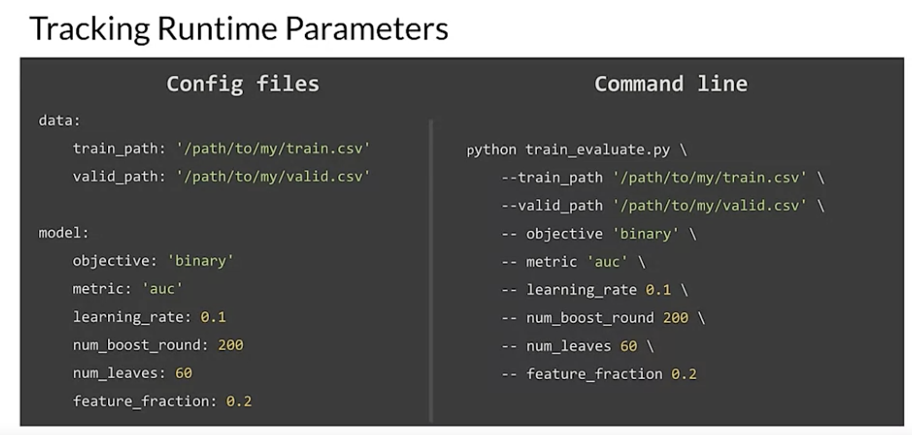
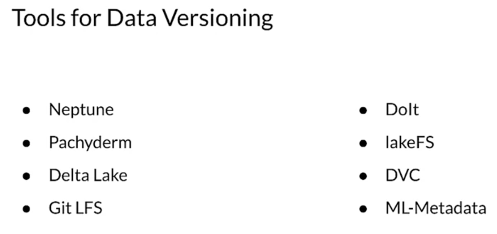

# Experiment Tracking

ML == experimental science
- In many ways, machine learning can be considered an experimental science since experimenting and analyzing results is at the heart of ML development. We need rigorous processes and reproducible results, which has created a need for experiment tracking.
- ML in practice is more of an experimental science than a theoretical one. Tracking the results of experiments, especially in production environments, is critical being able to make progress towards your goals.
- Keeping a clear record of the changes of the model and data over time can be a big help when you're trying to hunt down the source of the problem.
- Even small changes like changing the width of a layer or the learning rate can make a big difference in both the model's performance and the resources required to train the model. Even small changes like changing the width of a layer or the learning rate can make a big difference in both the model's performance and the resources required to train the model. 

## what it means to track experiments
1. First, you want to keep track of all the things that you need in order to duplicate a result.
   1. Some of us have had the unfortunate experience of getting a good result and then making a few changes that were maybe not well tracked and then finding it hard to get back to the setup that produced that good result.
2. Another important goal is being able to meaningfully compare results.
   1. This helps guide you when you're trying to decide what to do next in your experiment. But without good tracking, it can be hard to make comparisons of more than a small number of experiments.
3. It's important to track and manage all of the things that go into each of your experiments, including 
   1. your code, 
   2. your hyperparameters, 
   3. and the execution environment, 
      1. which includes things like the versions of the libraries that you're using and the metrics that you're measuring. 
4. Finally, because you're probably working in a team with other people, good tracking helps when you want to share your results with your team. 
   1. That usually means that as a team, you need to share common tooling and be consistent.

- At a basic level, especially when you're just starting out on a project, most or all of your experiments might be in a notebook. 
  - Notebooks are powerful and friendly tools for ML data and model development and allow for a nice iterative development process, including in-line visualizations. However, notebook code is usually not directly promoted to production and is often not well structured.
- One of the reasons that it's not usually promoted is that notebooks aren't just product code. 
  - They often contain notebook 
  - magics, 
  - special annotations that only work in the notebook environment, 
  - code to check the value of things 
  - and code to generate visualizations which you rarely want to do in a production workflow. 

### Tools to help
1. nbconvert, which among other things, can be used to extract the Python from a notebook
2. nbdime, which enables diffing and merging of Jupiter notebooks
3. jupytext, which converts and synchronizes pairs of notebooks with a matching Python file and much more, 
4. and neptune notebooks, which helps with versioning, diffing and sharing notebooks.

But as you move from simple, small experiments into production level experiments, you'll quickly outgrow the pattern of putting everything in a notebook. You should plan to write modular code, not monolithic code and the earlier in the process, the better, because you'll tend to do many core parts of your work over and over again. 

You'll develop reusable modules that will become high level tools, often specific to your environment, infrastructure, and team.
 
The simplest form of these is just a directory hierarchy especially if your whole team is working in a monorepo. But in more advanced and distributed workflow, code repositories and versioning with commits are powerful and widely available tools for managing large projects, including experiments.

As you perform experiments, you're often changing runtime parameters including your model's hyperparameters. It's important to include the values of those parameters in your experiment tracking and how you set them will determine how you do that. 
- A simple and robust method is to use configuration files and change those values by editing those files.
- Another option is to set your parameters on the command line.

# Tools
Along with your code and your runtime parameters, you also need to version your data. Remember that your data reflects a snapshot of the world at the time when the data was gathered and of course the world changes. If you're adding new data or purging old data or cleaning up your data, it will change the results of your experiments.

So just like when you make changes in your code or your model or your hyper parameters, you need to track versions of your data.

## Data Versioning Tools

1. Neptune which includes data versioning, experiment tracking and model registry.
2. Pachyderm which lets you continuously update data in the master branch of your repo while experimenting with specific data commits in a separate branch or branches. 
3. Delta Lake which runs on top of your existing data lake and provides data versioning including rollbacks and full historical audit trails. 
4. Git LFs which is an extension to get and replaces large files such as audio samples, videos, datasets and graphics with text pointers inside Git.
5. DoIt which is a SQL database that you can fork, clone, branch, merge, push and pull just like a Git repository.
6. LakeFS, which is an open source platform that provides a Git like branching and committing model the scales to petabytes of data. 
7. DVC, which is an open source version control system for machine learning projects and runs on top of Git. 
8. ML-Metadata, which is a library for recording and retrieving metadata associated with ML developer and data scientist workflows including datasets. 
   1. MLMD or ML-Metadata is an integral part of TFX but it's designed so that it can also be used independently.

# ML == lots of experiments

- TensorBoard is an amazing tool for analyzing your training, which makes it very useful for understanding your experiments. 
  - For example, you can use a TensorBoard callback to log metrics and logs the confusion matrix at the end of every epoch. 
  - When you display the results, you get a clear view of how your model is doing in this case by examining a confusion matrix.
  - By default the dashboard shows the image summary for the last log step or epoch. 
  - You can use the slider to view earlier confusion matrices. Notice how the matrix changes significantly as training progresses with darker squares, coalescing along the diagonal and the rest of the matrix tending towards zero &amp; white
- Organizing your experimental results from the start is important to help you understand your own work when you revisit it later and help your team understand it as well.
  - You want to make sure that it's easy to share and accessible. So that you and your team can collaborate especially when working on larger projects. 
  - Tagging each experiment and adding your notes will help both you and your team and help avoid having to rerun experiments more than once.
  - Tooling, which enables sharing can really help.
    - Neptune AI to send a link that shares a comparison of the experiments. It makes it easy for you and your team to track and review progress, discuss problems and inspire new ideas.
    - Vertex TensorBoard and similar cloud based tools can also offer significant advantages. First, like many infrastructure decisions, there are significant advantages to using a managed service, including security, privacy and compliance.

...Tools like that are a big help and a huge improvement over spreadsheets and notes.

ML goals for latency, cost, fairness, privacy, GDPR and so forth.

References
1. https://towardsdatascience.com/machine-learning-experiment-tracking-93b796e501b0
2. https://neptune.ai/blog/experiment-management