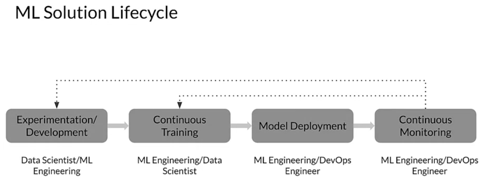
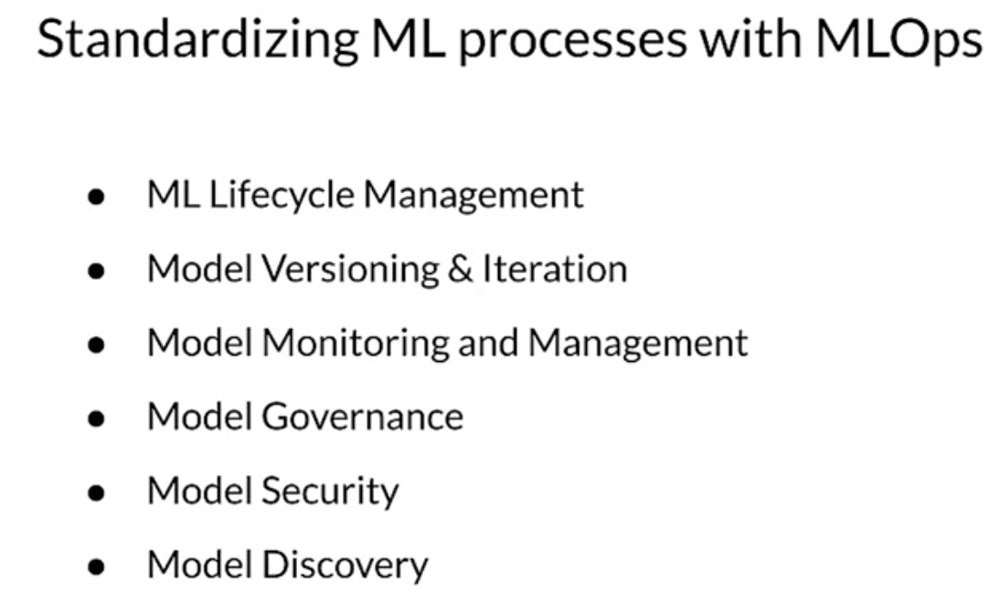

# Data Science vs. Software engineering

## Roles in engineering team
Two key roles in a MLOps team

1. Data Scientists
   1. Often work on fixed datasets
   2. Focus on optimizing model metrics
   3. Prototyping in Jupyter Notebooks
   4. Experts in modeling and feature engineering
   5. Model size, cost, latency, and fairness are often ignored
2. Software Engineer
   1. Focus on building products
   2. Concerned about cost, performance, stability, schedule
   3. Identify quality through customer satisfaction
   4. Must scale solution, handle large amounts of data
   5. Detect and handle error conditions, preferably automatically
   6. Consider requirements for security, safety and fairness
   7. Maintain, evolve and extend the product over long periods of time
   8. Often view the product as static with changes primarily the result of bug fix or features

## Growing needs for ML in Products and Services

1. Large datasets
2. Inexpensive on-demand resources
3. Increasingly powerful accelerators for ML
4. Rapid advances in mant ML research fields 
   1. CV
   2. NLP
   3. Recommenders
5. Businesses are investing in their data science teams and ML capabilities
   1. develop predictive models that can deliver business value to customers

All of this drives an evolution of product focused engineering practices for ML, which is the basis for the development of MLOps.

## Key problems affecting ML efforts
increased focus on ML workflows...

...we've seen this before
- In the 90s, SE was siloed
- Weak version control, back then CI/CD didn't exist
- SW was slow to ship, today = minutes
...Is this ML today?
- Model blocked before deployment, today takes months
- Slow to market (models are already decayed)  = missed oppourtunities
- Manual tracking, non-reproducible, no provenance = lack of repeatability
- Inefficient collaboration
- Unmonitored

## Bridging ML and IT with MLOPS
As ML emerges from research disciplines like software engineering, DevOps and ML need to converge forming MLOps.

- DevOps and is an engineering discipline which focuses on developing and managing software systems. It was developed over decades of experience and learning in the software development industry. Some of the potential benefits that it offers include reducing development cycles, increasing deployment velocity and ensuring dependable releases of high quality software.
- Like DevOps, MLOps is an ML engineering culture and practice that aims at unifying ML system development or dev and ML system operation or ops.
  - Unlike DevOps, ML systems present unique challenges to core DeVOps principles like continuous integration which for ML means that you not only just test and validate code and components but also do the same for data schemas and models.
  - Continuous delivery on the other hand, isn't just about deploying a single piece of software or service, but as a system more precisely, an ML pipeline that deploys a model to a prediction service automatically. 
- need to employ a novel DevOps automation techniques dedicated for training and monitoring machine learning models.
  - includes continuous training, a new property that is unique to ML systems, which automatically re trains models for both testing and serving. 
  - once you have models in production, it's important to catch errors and monitor inference data and performance metrics with continuous monitoring

## Phases in lifecycle

1. Experimentation / Development
   1. data scientists / ML engineering
   2. you start by shaping data and developing an ML model and continue by experimenting until you get results which meet your goals.
2. Continuous Training
   1. ML Engineering / data scientists
   2. you typically go ahead and set up pipelines for continuous training unless you already use the pipeline structure for your experimenting in model development, which I would encourage you to consider.
3. Model deployment
   1. ML engineering / Devops Engineer
   2. Then you turn to model deployment, which involves more of the operations and infrastructure aspects of your production environment and processes.
4. Continuous Monitoring
   1. ML Engineering / DevOps Engineer
   2. And then continuous monitoring of your model systems and data from your incoming requests. 
5. REPEAT
   1. The data from those incoming requests will become the basis for further experimentation and continuous training. 
   2. So, as you go from continuous training to model deployment, the tasks evolve into something that traditionally a DevOps engineer would be responsible for. 
   3. That means that you need a DevOps engineer who understands ML deployment and monitoring.

# What is MLOps

- a new practice for collaboration and communication between data scientists and operation professionals which is known as MLOps. 
- MLOps provides capabilities that will help you build, deploy and manage machine learning models that are critical for ensuring the integrity of business processes. It also provides a consistent and reliable means to move models from development to production by managing the ML Lifecycle.
- Models generally need to be iterated and versioned.
- To deal with an emerging set of requirements, the models change based on further training or real world data that's closer to the current reality.
- MLOps also includes creating versions of models as needed and maintaining model version history.
- as the real world and its data continuously change, it's critical that you manage model decay.
- With MLOps you can ensure that by monitoring and managing the model results continuously, you can make sure that accuracy, performance and other objectives and key requirements are acceptable.
- MLOps platforms also generally provide capabilities to audit compliance, access control, governance testing and validation and change and access logs. 
- The logged information can include details related to access control like who is publishing models, why modifications are done and when models were deployed or used in production.
- You also need to secure your models from both attacks and unauthorized access.
- MLOps solutions can provide some functionality to protect models from being corrupted by infected data, being made on unavailable by denial of service contracts or being inappropriately accessed by unauthorized users. 
- Once you've made sure your models are secure, trustable and good to go, it's often a good practice to establish a platform where they can be easily discovered by your team.
- MLOps can do that by providing model catalogs for models produced as well as a searchable model marketplace. 
- These model discovery solutions will provide information to track the data origination, significance, model architecture and history and other metadata for a particular model.
