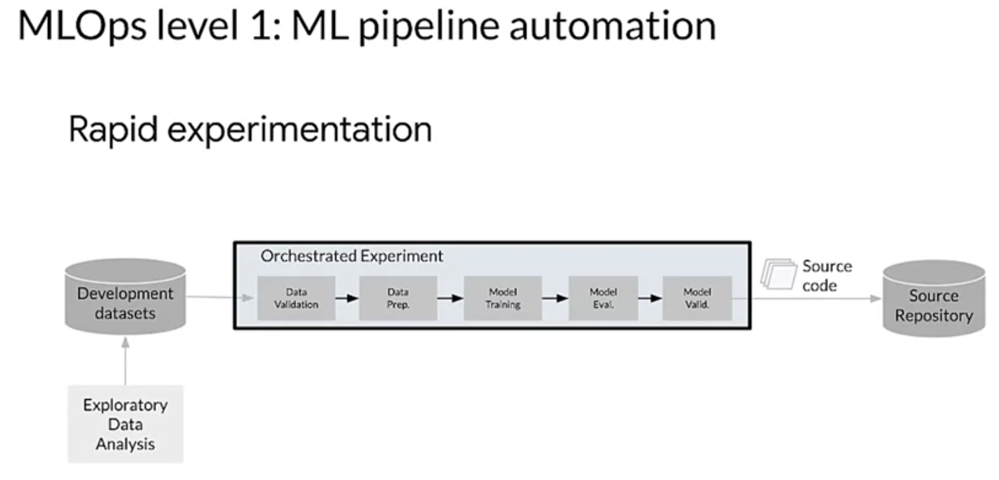
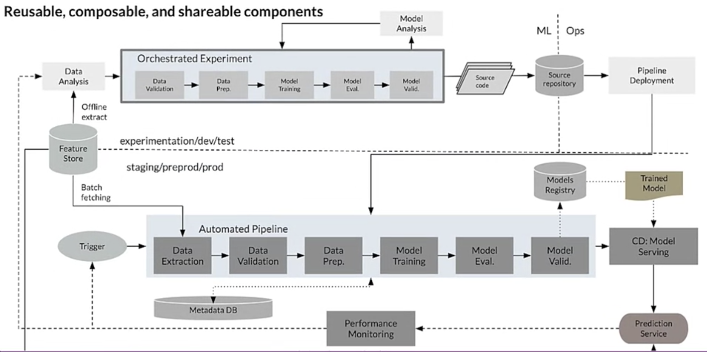
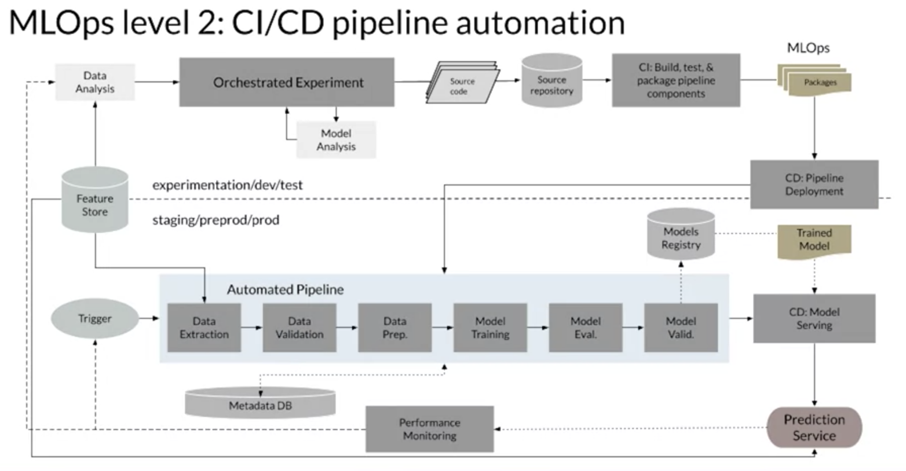
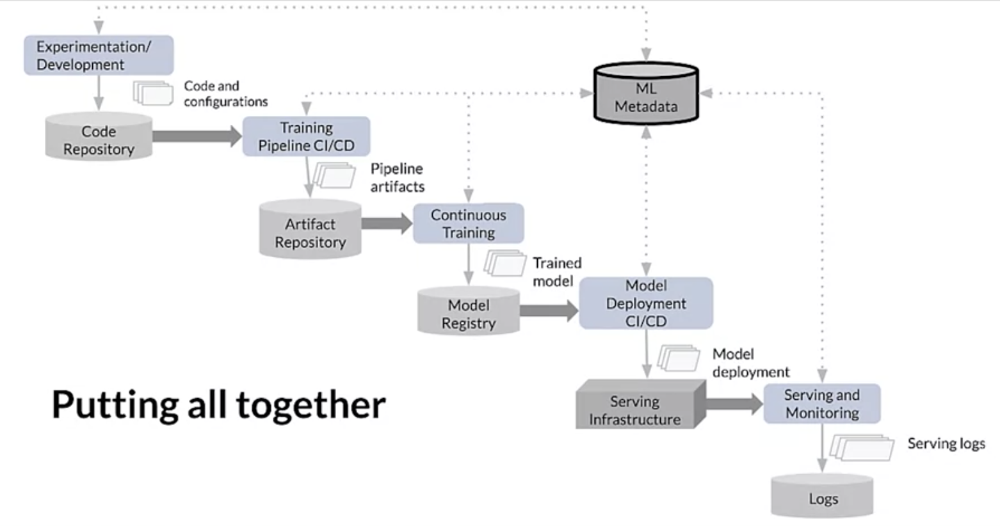

# MLOps Level 1 & 2

# Level 1
One of the key goals of level one is to perform continuous training of the model, by automating the training pipeline.
##Why? 
This lets you achieve continuous delivery of train models to your model prediction service.

## Requirements
To automate the process of using new data to retrain models in production, you need to 
1. introduce automated data and model validation steps to the pipeline
2. as well as pipeline triggers and metadata management

There is a need to have repeatable training in your ML workflows.

## Characteristics of Pipeline Automation

since the steps of the experimentation are orchestrated, the transition between steps is automated

## Multi-environment Pipeline Automation

Dev, test, staging, pre production, and production

- Note that the architecture shown here is typical, but different teams will implement this differently depending on their needs and infrastructure choices. 
- In this architecture, models are automatically retrained using fresh data based on live pipeline triggers
- The pipeline implementation that is used in the development or experimentation environment is also used in the pre production and production environment, which is a key aspect of MLOps practice for unifying the DevOPS effort. 
- To construct ML pipelines components need to be reusable, composable, and potentially shareable across pipelines.
  - while exploratory data analysis code can still live in notebooks, the source code for components must be modularized. 
    - Note if the exploratory data analysis is done using production components and a production style pipeline, it greatly simplifies the transition of that code to production.
  - In addition, components should ideally be containerized.
    - You do this in order to decouple the execution environment from the custom code runtime. 
    - It's also done to make code reproducible between development and production environments.
    - This essentially isolates each component in the pipeline, making them their own version of the runtime environment, and have different languages and libraries.
- An ML pipeline in production continuously delivers new models that are trained on new data to prediction services.
  - an automated process in which new models might be delivered on a schedule or based on a trigger
  - The model deployment step is automated, which delivers the trained and validated model for use by a prediction service for online or batch predictions
- In level zero, you simply deployed the trained model to production.
  - But here, you deploy a whole training pipeline, which automatically and recurrently runs to serve the train model as a prediction service. 

## Triggers
  - When you deploy your pipeline to production, one or more of the triggers automatically executes the pipeline
  - The pipeline expects new live data to produce a new model version that is trained on the new data.
  - **automated data validation and model validation steps are required in the production pipeline**

### data validtation
**data validation is necessary before model training to decide whether you should retrain the model, or stop the execution of the pipeline**
- This decision is automatically made only if the data is deemed valid
- For example, data schema skews are considered anomalies in the input data, which means that the downstream pipeline steps including data processing and model training, receives data that doesn't comply with the expected schema
  - In this case, you should stop the pipeline and raise a notification so that the team can investigate. 
    - The team might release a fix or an update to the pipeline to handle these changes in the schema.
      - Scheme skews include:
        - receiving unexpected features
        - not receiving all the expected features
        - receiving features with unexpected values
      - data value skews which are significant changes in the statistical properties of data, and you need to trigger retraining of the model to capture these changes.

### model validation
** runs after you successfully train the model given the new data**
- you evaluate and validate the model before it's promoted to production
- This offline model validation step may involve first producing evaluation metric values, using the train model on a test data set to assess the model's predictive quality
- Then, the next step would be to compare the evaluation metric values produced by your newly trained model to the current model.
- For example, the current production model or a baseline model or any other model which meets your business requirements.
- Here, you make sure that the new model performs better than the current model before promoting it to production.
- you ensure the performance of the model is consistent on various segments or slices of the data.
- Your newly trained customer churn model might produce an overall better predictive accuracy compared to the previous model, but the accuracy values per customer region might have a large variance.
- infrastructure compatibility and consistency with the prediction service API, are some other factors that you need to consider before finally deploying your models. In other words, will the new model actually run on the current infrastructure?
- In addition to offline model validation, a newly deployed model undergoes online model validation in either a canary deployment or an AB testing setup during the transition to serving prediction for the online traffic. 

## feature store
**An optional additional component for level one MLOps is a feature store.**
- A feature store is a centralized repository where you standardize the definition, storage, and access of features for training and serving. 
- Ideally, a feature store will provide an API for both high throughput batch serving and low latency, real time serving for the feature values, and support both training and serving workloads. 
- it lets you discover and reuse available feature sets instead of recreating the same or similar feature sets, avoiding having similar features that have different definitions by maintaining features and their related metadata
- you can potentially serve up to date feature values from the feature store, and avoid training serving skew by using the feature store as a data source for experimentation, continuous training, and online serving.
  - This approach makes sure that the features used for training are the same ones used during serving
- when it comes to experimentation, data scientists can get an offline extract from the feature store to run their experiments
- For continuous training, the automated training pipeline can fetch a batch of the up to date feature values of the data set.For continuous training, the automated training pipeline can fetch a batch of the up to date feature values of the data set.
- For online prediction, the prediction service can fetch feature values such as customer demographic features, product features, and current session aggregation features.

## metadata store
**key component is the metadata store, where information about each execution of the pipeline is recorded in order to help with data and artifact lineage, reproducibility, and comparisons**
- helps you debug errors and anomalies
- Each time you execute the pipeline, the metadata store tracks information such as:
  - the pipeline and component versions which were executed, 
  - the start and end time and date, 
  - how long the pipeline took to complete each of the steps, 
  - the input and output artifacts from each step, and more
- what this means is that you could rely on pointers to the artefacts produced by each step of the pipeline, like the location of the prepared data or the validation anomalies, computed statistics, and so on to seamlessly resume execution in case of an interruption
- tracking these intermediate outputs, helps you resume the pipeline from the most recent step if the pipeline stopped due to a failed step without having to restart the pipeline as a whole

# Level 2

The truth is that the current stage are at the current stage of the development of MLOps best practices, level two is still somewhat speculative
- the diagram presents one of the current architectures, which is focused on enabling rapid and reliable update of the pipelines in production. 
- requires robust automated CICD to enable your data scientists and ML engineers to rapidly explore new ideas around:
  - feature engineering, 
  - model architecture, 
  - and hyperparameters
- They can implement these ideas and automatically build test, and deploy new pipeline components to the target environment.
- includes components like:
  - source code control, 
  - test and build services, 
  - deployment services, 
  - a model registry, 
  - a feature store, 
  - a metadata store, 
  - and a pipeline orchestrator

## level 2 lifecycle

1. First, you have experimentation and development. 
   1. This is where you iteratively try out new algorithms and new modeling, and the experiment steps are orchestrated.
   2. The output of this stage is the source code of the ML pipeline steps that are then push to a source repository. 
2. Next, comes the CICD stage for the training of the pipeline itself or for the training pipeline itself
   1. Here, you build the source code and run various tests. 
   2. The outputs of this stage, our pipeline entities like software packages, executables and artifacts to be deployed in the later stage.
   3. The output of this stage is a deployed pipeline with a new implementation of the model. 
3. Then you train your models. 
   1. Here, the pipeline is automatically executed in production based on a schedule or in response to a trigger.
      1. The output of this stage is a trained model, and that is pushed to the model registry.
4. Once the model's been trained, the goal of the pipeline is now to deploy the model using continuous delivery.
   1. You do this by serving the train model as a prediction service for predictions. 
   2. The output of this stage is a deployed model prediction service.
5. Finally, once all of your models have been trained and deployed is the role of the monitoring service to collect statistics on the model performance based on live data.Finally, once all of your models have been trained and deployed is the role of the monitoring service to collect statistics on the model performance based on live data.
   1. The output of this stage is the data collected in the logs from the operation of the serving infrastructure, including the prediction request data which will be used to form the new data set and retrain your model

# References
1. https://github.com/visenger/awesome-mlops
2. https://neptune.ai/blog/mlops