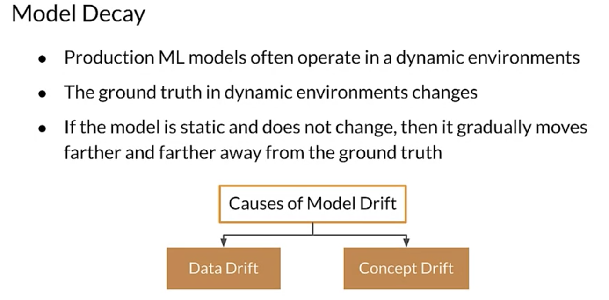
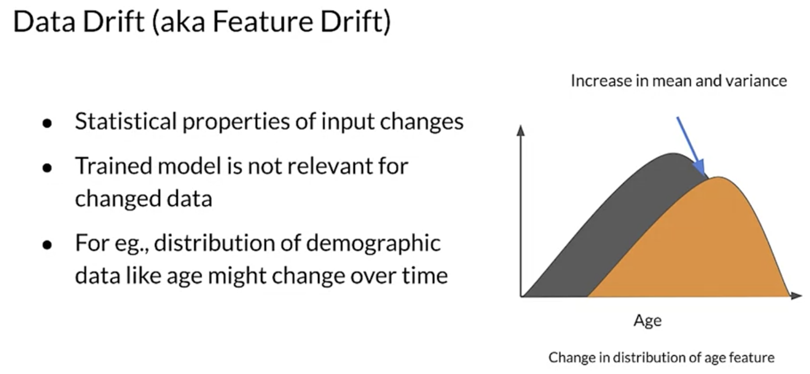
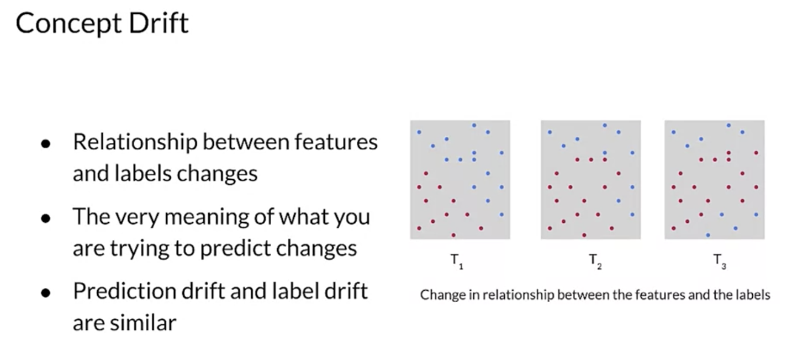

# Model Decay

Production ML models often operate in dynamic environments. Over time, dynamic environments change. That's what makes them Dynamic. Think of a recommender system, for example, that is trying to recommend which music to listen to. Music changes constantly, with new music becoming popular and taste changing. If the model is static and continues to recommend music that has gone out of style, then the quality of the recommendations will decline. The model is moving away from the current ground truth. It doesn't understand the current styles because it hasn't been trained for them. So there are two main causes of model drift. Data drift and concept drift.

Think of a recommender system, for example, that is trying to recommend which music to listen to. Music changes constantly, with new music becoming popular and taste changing. If the model is static and continues to recommend music that has gone out of style, then the quality of the recommendations will decline. The model is moving away from the current ground truth. It doesn't understand the current styles because it hasn't been trained for them. 

## Data Drift ("Feature Drift)

- Data drift occurs when statistical properties of the input, the features, changes. 
- As the input changes, the prediction requests, the input moves farther away from the data that the model was trained with, and model accuracy suffers.
- often occur in demographic features like age, which may change over time. 

## Concept Drift

- Concept drift occurs when the relationship between the features and the labels changes. 
- When a model is trained, it learns a relationship between the inputs and ground truth or labels. If the relationship between the inputs and the labels changes over time, it means that the very meaning of what you are trying to predict changes.

For example, take a look at the graph on the right side. You can see that the distribution of the features for the two classes, the blue and red dots, changes over time intervals, T1, T2, and T3. If your model is still predicting for T1 when the world has moved to T3, many of its predictions will be incorrect. I should also mention here that there are related forms of drift known as prediction drift. Where drifts solely in your model's predictions and labeled drift

If you don't plan ahead for drift, it can slowly creep into your system over time. How fast your system drifts depends on the nature of the domain that you're working in. Some domains like markets can change within hours or even minutes. Others change more slowly. If drift, either data drift or concept drift or both, is not detected, then your model accuracy will suffer and you won't be aware of it.

## What if you don't plan ahead for drift?
This can lead to emergency retraining of your model, which is something to avoid. So monitoring and planning ahead are important. 
