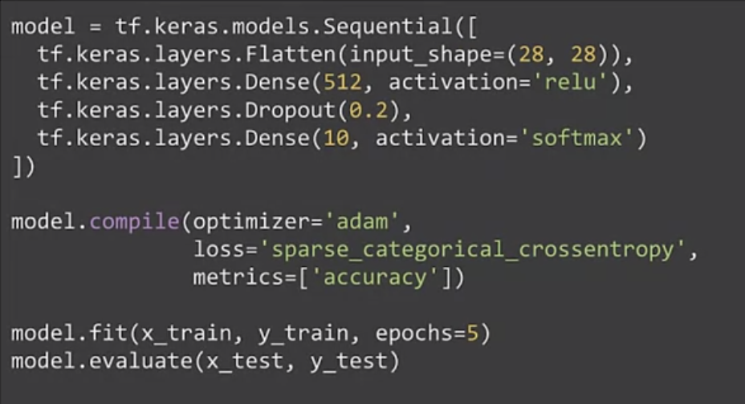
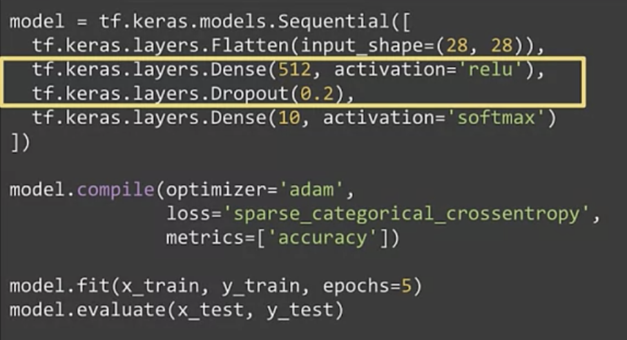
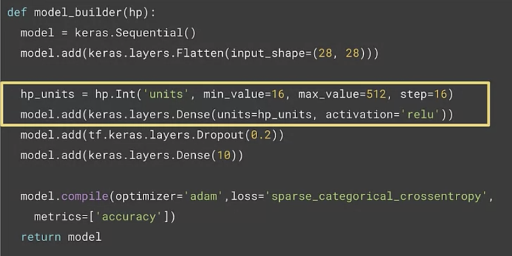
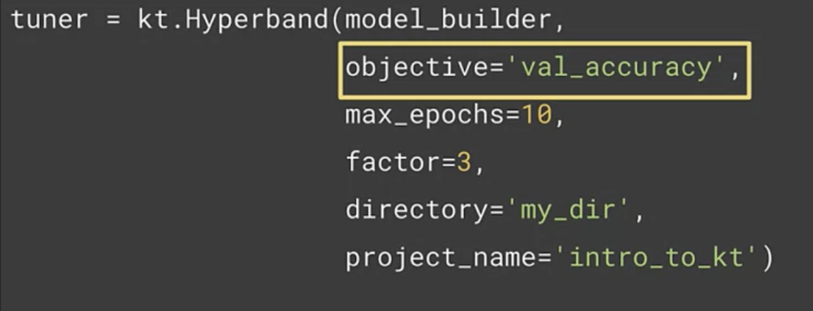
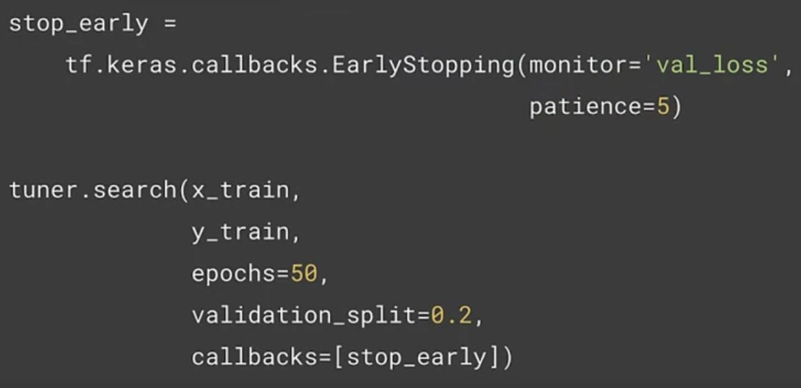
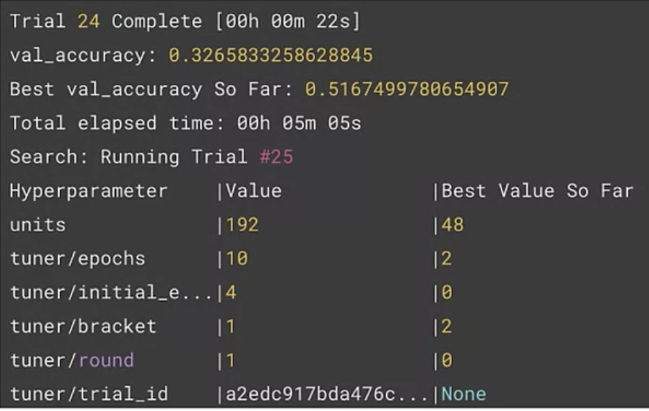
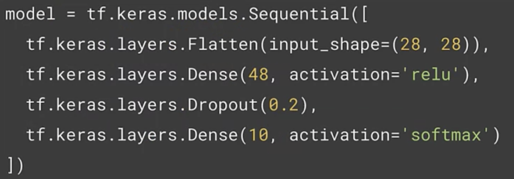
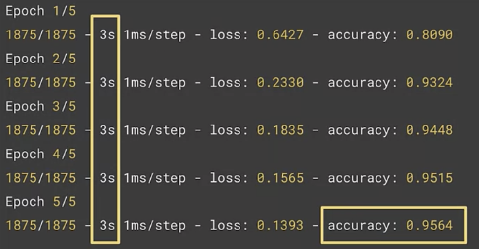

# Hyperparameter Tuning

Or Hypertuning

## Neural Architecture Search (NAS) 
- tecnique for automating design of artificial neural networks
- helps to find optimal architecture
- searches over a huge space
- AutoML is an algorithm to automate the search

## Type of parameters in ML Models
Two types of parameters
1. Model "trainable" parameters
  - Learned by the algorithm with the training set
  - Updated each training step  
  - weights and biases
2. Hyperparameters
  - set before launching the learning process
  - not updated each training step
  - learning rate or the number of units in a dense layer
  - Tuning manually is tedious 

## Hyperparameter tuners
1. Keras "Auto" Tuner
  - hyperparameter tuning with TF 2.0
  - It offers a variety of different tuning methods, including
      - random search
      - Hyperband
      - Bayesian optimization




### Questions
- will the model do better with less hidden units?
- how does the model size affect the convergence speed?
- is there tradeoffs between convergence speed, model size and accuracy?

...ultimately, search automation is the natural path to take

### Install Keras Tuner
```
# first install of Keras tuner
!pip install -q -U keras-tuner

# import Keras tuner after installation
import kerastuner as kt
```

### Def funtion for iterative search
Search can take a while to complete
notice the hp_units that keras tuner will search over
    - hp.Int = tuned by keras tuner. This will be tuned by the Keras tuner. So this sets up an integer value starting at 16 and going to 512 in steps of 16.
    - value  drives the number of times kt searches


notice the search strategy
    - kt.Hyperband sets the strategies  
    - notice the objective you want to optimize on the validation accuracy


notice tuner.search
    - early stopping callbacks
    - here I'm monitoring the validation loss and the patience is set to five, which means that it doesn't change significantly, or if it doesn't change significantly in five epics, then stop searching on this iteration. 
    - and you set the call back as a search parameter.


Last you will apply the results of the trials to the keras tuner




Notice the epochs are still completing in 5 times, but they are 3 times faster for 95% accuracy


