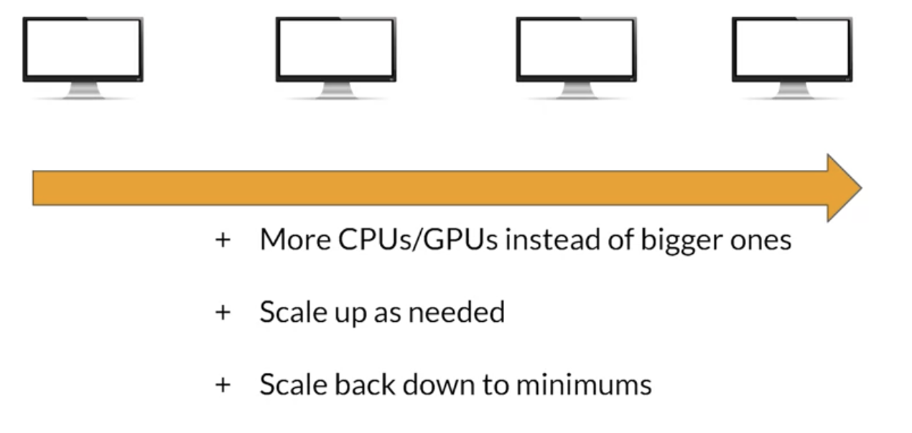
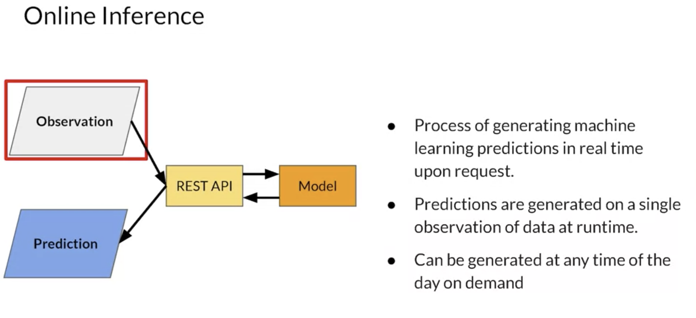

# Scaling

## Why it's important?

- consider the costs of training deep neural networks with billions of operations on huge datasets
- It could take days to complete training on a standard CPU or a single GPU
  - If you can scale out the hardware on which the training runs, and then distribute the training across different items of hardware and maybe even distribute the data by sharding it across this hardware you can make that training far more efficient.
- he larger and more sophisticated the network, the more parameters that need to be tuned and fine-tuned.
- Consider large networks that have many millions of parameters that need to be learned. 
- Not only that, consider what happens when you have deployed your model to a server. Huge volumes of requests to the server for inference can overwhelm it. 
  - So the ability to scale the runtime inference, as well as the training is vital. 

There are two main ways to scale, horizontal and vertical. So let's start with vertical.

## Vertical (more power)

- using bigger and more powerful hardware
- If your car could only hold five people and you need to move 100 people, you can get a bigger car that holds 10 people. So then you can move twice as fast. 
- recommended
  - 
## Horizontal (borrow)

- adding more devices to the network. It adds more GPUs or CPUs when the load increases
- Instead of buying a bigger car, you could get 20 cars the same size and transport all 100 people at once. 
- To follow that metaphor, you could just borrow the other 19 cars along with your own for the time that you need them. 
- recommended
  - elasticity
    - instead of getting rid of your reliable car to get a bigger one and only chip away the problem, you could lease 19 cars just like your own and give them back when you're done.
    - if you're scaling vertically, you generally have to take your app offline in order to upgrade the hardware resources. When it's elastic, you don't need to do this, you just spin up new ones.
  - frameworks such as Google's App Engine are also really smart in using machine learning to predict usage patterns so that they can pretty warm up the machines before they're actually needed, reducing overall latency. 
  
That's basically the same concept with cloud computing, where you can scale up to your need and scale right back down again when you don't need it anymore and only pay for what you use.

## Horizontal over Vertical

1. Can I manually scale? 
2. What happens if I say I only want 20 instances of a VM? 
3. Can I autoscale? 
4. What happens if I want my app to automatically spin up and down based on demand? 
5. What does latency and costs look like? 
6. How aggressive is the system at spinning up and down based on my need? 
7. How can I manage my additional VMs to ensure that they have the content on them that I want?
8. For machine learning, there might be a lot of dependencies, access to data, permissions, and many other configurable items. If I'm going to scale horizontally, I want the new machines to be able to be up and running quickly. 

For that, there's containerism.

## Containers

- Let's think about a typical system where I may have a number of apps that are running. 
- The pattern will generally look like this, where I have my apps running using some binaries or libraries within an operating system that's executed by hardware. 
- An extension to this is the virtual machine architecture, where the apps can still run on bin library within an operating system, but that operating system does not run on hardware, and instead it runs on a virtual machine that has no hardware. 
  - This VM is managed by a hypervisor which acts as the manager of the virtual machines, each with its own operating system bin and apps as shown. 
  - The hypervisor will typically run on the metal of the hardware. 
  - Already, you can see how this could be used for horizontal scaling. 
    - Our hardware might support multiple instances of operating systems and apps as shown here. 
    - This is pretty cool, but it can face a limitation. Namely that each VM has to have a lot of stuff on it, not at least a full operating system. 
    - As such, it might not be the most efficient use of resources in the system and that's where containers can help. 
- As you can see, architecturally, they're quite similar to the VM concept, except they don't require separate operating systems per partition so that they are much lighter in weight and the same hardware can typically manage more containers than virtual machines. 
- Consider the advantages of using containers because 
  - each app instance doesn't require an operating system
  - you can generally run more of them on the same hardware
  - giving you much better horizontal scalability
  - The abstraction of having them run within a container runtime also gives you this greater flexibility on hardware that supports a container runtime. 
  - You don't need to worry about the operating system, your app just works. 
- This leads to easier deployment and more options in deployment.

### Docker

- offer you a really convenient way to do horizontal scaling, but then not without challenges of their own.
- you might want to run multiple containers on multiple machines and try to keep them all in sync. Like any app, even one in a container, it's at risk of going down or the container host itself might fail. So you also want to keep a fleet of containers on a hot standby so you can switch traffic over should one go down.

## Orchestration

- The idea behind container orchestration is simple. It's having a set of tools to do things like managing the lifecycle of containers, including their scaling. On top of your container manager, container orchestration generally gives multiple services such as resource management to ensure that the containers aren't overallocating hardware resources, scheduling so that containers meet up and downtime requirements and of course, general service management so you can manage how the orchestration environment does its job.
- Two of the more popular container orchestration tools are Kubernetes and Docker Swarm.
- Kubernetes underpins Kubeflow, 
  - it's an open source system for automating, deployment, scaling, and management of containerized applications. A group's containers that make up an application into logical units for easy management and discovery. Kubernetes builds upon many years of experience in building scalable applications at Google combined with community experience with a goal to bring you the best of both worlds.
  
### KubeFlow

- When it comes to deploying ML workflows on Kubernetes, Kubeflow evolved. It's designed to make deployments of ML workflows so that data ingestion, feature extraction, training, model management, and all of those kind of things are portable and scalable using Kubernetes.
- An important attribute of Kubeflow is that it's designed so that anywhere Kubernetes can run, you can use it. 

# Online Inference

A typical interaction between a model and a caller online looks a bit like this. 
The interface between the outside world and the collar is via rest API. 
You'll typically have some form of data about the user often called an observation upon which you want to get a prediction. 
This might be for example context about a customer that can be used to predict what type of purchases may be appropriate for them so that you could have a recommended list. 
Or perhaps it might be something like a smart reply generator where in a conversation the text can be used to auto generate replies that the user can select. 
The observation is posted to the model via rest API and the return prediction is rendered

## Latency

- You want to optimize for latency and how long does it take for the data to be passed to the server, for the inference to execute and then for the response to be handled. 
- It's not just the inference, you could have a poorly designed app that has a fabulous model and if latency is introduced by the transport of the data or even the rendering of the results, the user will see a delay. 
- it's key to manage latency in all parts of your application design
- the focus of this course of course is on the model and the infrastructure but it is important for you to keep an eye on the total latency of your system.
- 
## Throughput

- While throughput is important for all systems, the throughput measured in requests managed per unit time is often more important for non customer facing systems like intensive data processing apps. 
- it could be solved often with the type of horizontal scaling

## Budget

- Most budgets aren't unlimited, so work that you do to make latency and throughput as efficient as possible. 
- We'll have a cost, you need to take this into account always there are multiple costs in your system. 
- Not just hardware but things like engineering and testing time and effort? Software licenses, opportunity costs for slow updates and lost costs for new applications.

## Inference

### Infrastructure
- the infrastructure used to serve the models and handle the user input and output.
- scaled with additional or more powerful hardware as well as containerized a virtualized environments

### Model Architecture and Metrics trained and tested
- Often there's a trade off between inference speed and accuracy, If a 99% accurate model is 10 times slower than a 98% accurate model, is it really worth the extra cost?

### Model Compilation
- If you know the hardware on which you're going to deploy the model. For example, a particular type of GPU there's often a post training step that consists of creating a model artifact and a model execution runtime that's finally adapted to the underlying support hardware. You can refine your model graph and inference runtime to reduce memory consumption and latency.

### Application Layer

- there's a lot of hitting database is going on here, so an obvious optimization you can do is to consider common scenarios to be cached in something faster than a typical data store.
- cache popular queries in fast storage
- Fast data cashing is usually achieved using no sequel databases on memory cashing. 
- There's a few products out there that can handle this such as amazon's dynamodb google cloud's memory store, which used to be called meme cache.

# Resources

- https://github.com/https-deeplearning-ai/machine-learning-engineering-for-production-public/tree/main/course4/week2-ungraded-labs/C4_W2_Lab_2_Intro_to_Kubernetes
- https://www.youtube.com/watch?v=aIxNm5Eed_8
- https://kubernetes.io/docs/tutorials/kubernetes-basics/
- https://www.youtube.com/watch?v=H06qrNmGqyE
- https://www.youtube.com/watch?v=dC659IsHNyg&list=PLIivdWyY5sqLS4lN75RPDEyBgTro_YX7x&index=4