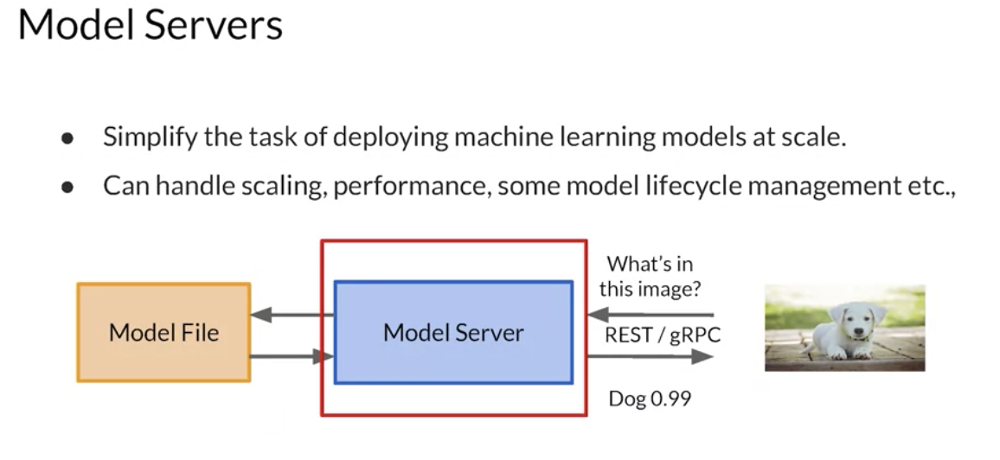
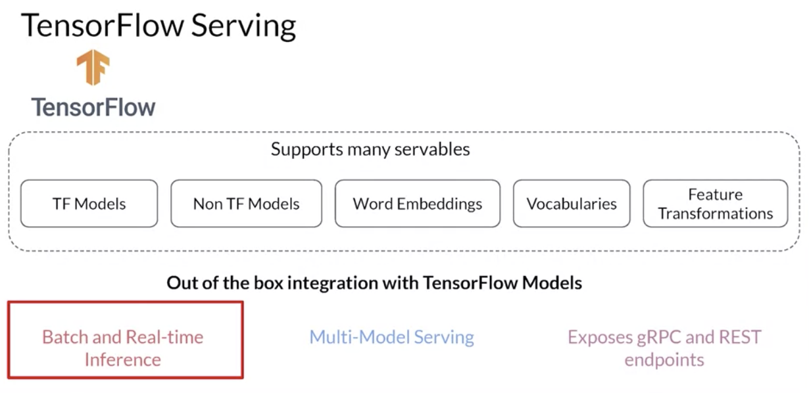
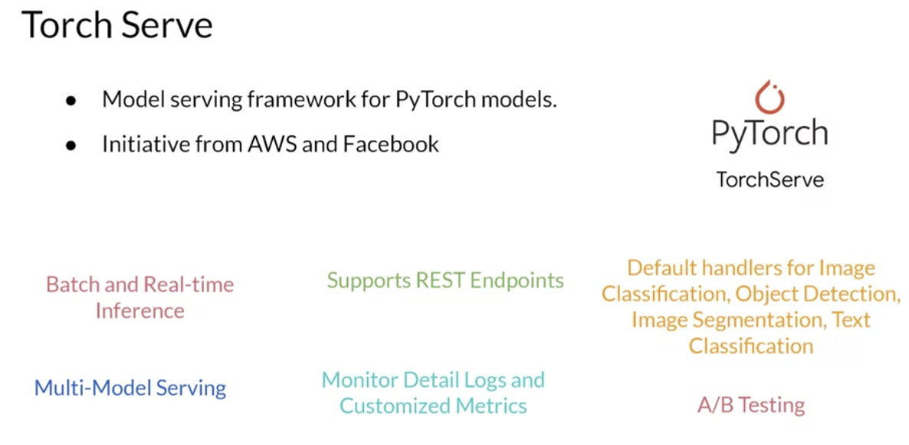
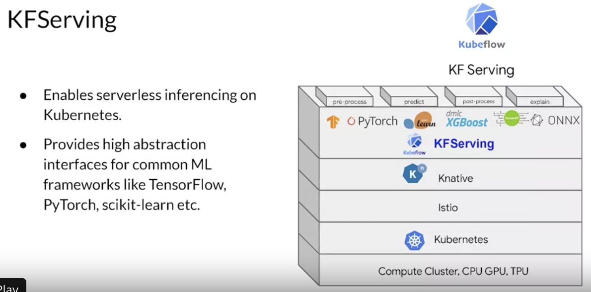
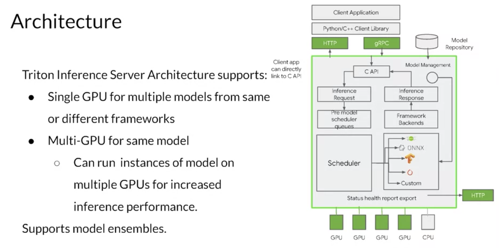

# Model Serving

## Two places to build and use ML models:
1. On Prem - all hardware and software
   1. Infrastructure
      1. complete control over infrasutructure
      2. train and deploy
      3. manually procure harwdare (GPU, CPU, etc.)
      4. works for larger Co. due to economies of scale
      5. profitable for large Co. over longer time
   2. Serving
      1. can use open source and prebuilt server
      2. TFServe, KFServing NVIDIA, etc
2. On Cloud - outsource hardware and software services to provider
   1. Infrastructure
      1. Train and deploy on cloud 
      2. AWS, GCP, Azure
   2. Serving
      1. Create VMs and use open source pre-built servers
      2. use the provide ML workflows
         1. GCP - AutoML
         2. AWS - SageMaker AutoPilot

## Model Servers

### Characteristics

- Model is saved to file system
- likely you will store multiple versions
- Model Server 
  1. instantiates the model 
  2. expose the methods on the model for use
- So for example, if the model is an image classifier
  - the model itself will take in tensors of a particular size and shape. 
    - For mobile net, these would be 224 by 224 by 3. 
  - The model server receives this data formats it into the required shape
    - passes it to the model file and gets the inference back. 
  - It can also manage multiple model versions should you want to do things like AB testing or have different users with different versions of the model. 
  - And the model server then exposes that API to the clients as we previously mentioned. 
  - So in this case for example, it has a REST or RPC interface that allows an image to be passed to the model. The model server will handle that and get the inference back from the model, which in this case is an image classification and it will return that to the collar.

### Model Servers

#### TensorFlow Serving

- batch (recommender) and real-time (single task quickly like image) inference
- TF models, non-TF models, Word Embeddings, Vocabularies, Feature Transformations
- multi-model serving (A/B, segmentation, etc)
- exposes gRPC and REST endpoints
- The high level architecture for tensorflow serving
  - built around core ideal of **servable** the central abstraction in TF serving
    - A typical servable is a tensorflow saved model 
    - it could also be something like a look up table for an embedding.
  - Sources
    - saved models or lookup tables stored
  - Loader manages servables lifecycle
    - loader API enables common infrastructure independent from specific learning algorithms, data or whatever product use cases were involved
    - standardized the API is for loading and unloading a servable
  - Aspired versions set of servable versions that are loaded and ready
    - Sources communicate this set of servable versions for a single servable stream at a time when a source gives a new list of aspired versions to the manager
  - Dynamic Manager unloads previously 
    - loading, unloading and serving versions
      - unloads any previously loaded versions that no longer appear in the list
      - handles the full life cycle of the survivals, including loading the survivals serving the survivals and of course unloading the survivals
      - listen to the sources and will track all of the versions according to a version policy and the servable handle provides the exterior interface to the client
  - Servable Handle
  - https://www.tensorflow.org/tfx/serving/architecture

#### PyTorch TorchServe

- initiative by AWS and Facebook to build a model serving framework for PyTorch models
- Before the release of TorchServe, if you wanted to serve PyTorch models, 
  - you had to develop your own model serving solutions like custom handlers for your model, 
  - you had to develop a model server, 
  - maybe build your own Docker container
  - You had to figure out a way to make the model accessible via the network and integrated it with your cluster orchestration system, etc.
- With TorchServe, you can deploy PyTorch models in either eager or graph mode. 
- You can serve multiple models simultaneously. 
- You can have version production models for A/B testing. 
- You can load and unload models dynamically 
- You can monitor detail blogs and customizable metrics. 
- Best of all, TorchServe is open source. 
  -  it's extensible to fit your deployment needs.
- supports 
  - batch and real-time
  - REST endpoints
  - multi-model serving
  - monitor logs and customized metrics
  - A/B testing
  - default handlers for models
- Architecture
  - The front end is responsible for handling your requests and your responses
    - handles both requests and responses coming in from clients and the model life cycle
  - The back end users model workers that are running instances of the model loaded from a model store
    - responsible for performing the actual inference 
  - multiple workers can be run simultaneously on TorchServe
    - can be different instances of the same model 
    - OR, they could be instances of different models
  - Instantiating more instances of a model enables handling more requests at the same time and can increase the throughput
  - A model is loaded from cloud storage or from local hosts
  - support serving of eager mode models and jet saved models from PyTorch
  - The server supports APIs for management and inference, as well as plugins for common things like server logs, snapshots, and reporting
- https://github.com/pytorch/serve

#### KF Serving

- allows you to use a compute cluster with Kubernetes to have serverless inference through abstraction
- works with TensorFlow, PyTorch and others
- https://www.kubeflow.org/docs/components/serving/

#### NVIDIA Triton Inference Server

- simplifies deployment of AI models at scale in production
- open-source inference serving software that lets teams deploy trained AI models from any framework: TensorFlow, TensorRT, PyTorch, ONNX Runtime, or even a custom framework
- deploy from local storage or from a Cloud platform, like the Google Cloud Platform or AWS, on any GPU or CPU-based infrastructure
- runs multiple models from the same or different frameworks concurrently on a single GPU using CUDA streams
- In a multi-GPU server, it automatically creates an instance of each model on each GPU
- increase your GPU utilization without any extra coding from the user
- supports low latency real-time inferencing with batch inferencing to maximize GPU and CPU utilization
- built-in support for streaming inputs if you want to do streaming inference
- Inputs and outputs need to be passed to and from Triton's Inference Server can be stored in the systems or the CUDA shared memory
- can reduce the HTTP C or gRPC overhead and increase overall performance
- supports model ensemble
- integrates with Kubernetes for orchestration, metrics, and auto scaling
- integrates with Kubeflow and Kubeflow Pipelines for an end-to-end AI workflow
- exports Prometheus metrics for monitoring GPU utilization, latency, memory usage, and inference throughput
- supports the standard HTTP gRPC interface to connect with other applications like load balancers
- can serve tens or hundreds of models through the Model Control API
- serve models and CPU too
- supports heterogeneous cluster with both GPUs and CPUs and does help standardized inference across these platforms
- https://developer.nvidia.com/nvidia-triton-inference-server