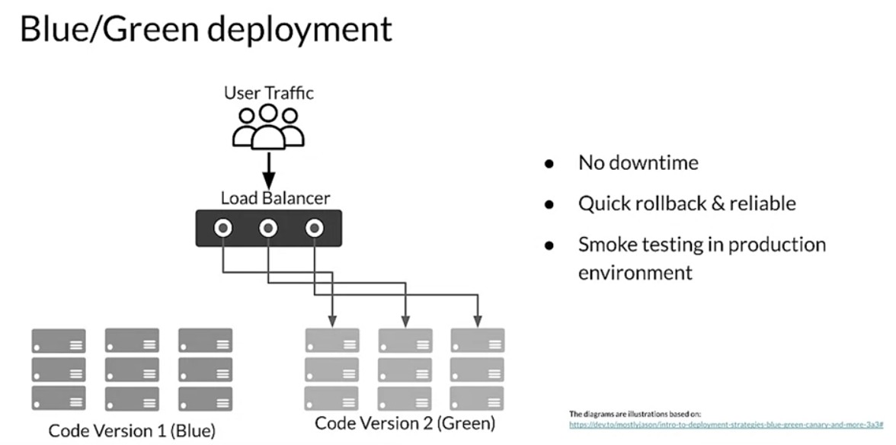

# Manage Model Versions

normal software version control software helps manage code: sync, roll back, CI, etc.

generating models, you typicall generate several models made up of (code, data, config) that demands model versioning

How to version models?

in software
MAJOR.MINOR.PATCH
1. MAJOR: increases when incompatible API changes are added
2. MINOR: adds functionality in backwards compatibile manner
3. PATCH: makes backwards compatible bug fixes

for models
1. no uniform standard accepted 
2. different organizations have different conventions

proposal
MAJOR.MINOR.PIPELINE
1. MAJOR: increases when incompatible data changes, schema or target variable change, that renders model incompatible when used for predictions
2. MINOR: increases when model performance is improved
3. PIPELINE: correspond to an update to training pipeline but may not change the model itself

Other versioning styles include arbitrary grouping, black-box functional models, and pipeline execution versioning, but will not discuss them here.

## Retrieving older models
the framework must be internally versioning models
1. model lineage
   1. Model lineage is a set of relationships among the artifacts that resulted in the trained model. To build model artifacts, you have to be able to track the code that builds them and the data, including pre-processing operations that the model was trained and tested with.
   2. code, data, config, model
2. model registries
   1. central repo for storing trained models
   2. A model registry is a central repository for storing trained models. Model registries provide an API for managing train models throughout the model development lifecycle. Model registries are essential in supporting model discovery, model understanding, and model reuse, including in large-scale environments with hundreds or thousands of models.
   3. Model registries are really very useful things to have. 
   4. Model registries promote model search and discoverability within your organization and that can help improve the understanding of the model among your team. 
   5. Model registries can help enforce a set of approval guidelines which need to be followed when uploading models, which can help improve governance. 
   6. By sharing models with your team, you're improving the chances of collaboration among your co-workers. 
   7. Model registries can also help streamline deployments. 
   8. Model registries can even provide a platform for continuous evaluation, monitoring, and staging, and promotions. 
   9. For example, there's 
      1. Azure ML model registry, 
      2. SAS Model Manager, 
      3. MLflow Model Registry, 
      4. the Google AI platform, 
      5. and Algorithmia.

## Continuous Delivery

### CI
In more mature MLOPs processes and where more than a few models need to be managed. 
It's important to implement a robust deployment process.
First, before deploying you need to make sure that your code works which you should determine through comprehensive unit testing. 
This is automated with continuous integration or CI. 
CI triggers whenever new code is committed or pushed to your source code repository. 
It mainly performs building, packaging and testing for the components. 
The quality of the testing will be determined by the coverage and quality of your unit test suite. If all tests pass, it delivers the tested code and packages to a continuous delivery pipeline. 

### CD
Next, continuous delivery or CD deploys new code and trained models to the target environment. 
It also ensures compatibility of code and models with the target environment. 
And for an ML deployment it should check the prediction service performance of the model to make sure that the new model can be served successfully. 
The full continuous integration, continuous delivery process and infrastructure is referred to as CI/CD. 

### CI/CD MLops
During experimentation data analysis and model analysis are usually manual processes which are performed by data scientists. 
Once a model and code have been promoted to a production training pipeline data and model analysis should be performed automatically. 
As part of the promotion of the code to production source code is committed to a source code control and CI is initiated. CD, then deploys the production code to a production training pipeline and models are trained. 
Train models are then deployed to an online serving environment or batch prediction service. During serving the performance monitoring collects the performance metrics of the model from live data.

### Testing
the two main tests that are performed during continuous integration. Unit testing and integration testing

#### Unit
In unit testing you test each component to make sure that they're producing correct outputs. 
In addition, to unit testing our code, which follows the standard practice for software development. 
There are two additional types of unit tests when doing CI for machine learning. 
The unit tests for our data and the unit tests for our model. 

##### Data
It's primarily concerned with the results of your feature engineering.
check if engineered features are calculated correctly. 
check whether they are scaled or normalized correctly.
do tests to confirm if columns and data are the correct types in the right range, not empty 

##### Model
Your modelling code should also be written in a modular way which allows it to be testable.
write unit tests for the functions you use inside your modeling code to check if the functions return their output in the correct shape and type. 
For numerical features includes testing for NaN or not a number 
For string features includes testing for empty strings and so forth
add tests to make sure that the accuracy, error rates, AUC ROC etc are above a performance baseline that you specify
Even if the trained model has acceptable accuracy you need to test it against data slices to make sure that the model is accurate for key subsets of the data in order to avoid bias. 

##### Other

the design of your mocks which is especially important for ML unit testing. 
mocks should be designed to cover your edge and corner cases which requires you to think about each of your features and your domain and identify where those edge and corner cases are. 
mock should occupy roughly the same region of your feature space as your actual data would but much more sparsely. 
mock data set should be much smaller than your actual data set in most cases. 
If you've created good mocks and good tests, you should have good code coverage, but just to be sure take advantage of one of the available libraries to test and track your code coverage.

#### Infrastructure Validation
Infrastructure validation acts as an early warning layer before pushing a model into production to avoid issues with models that might not run or might perform badly when actually serving requests in production. 
Focuses on the compatibility between the model server binary and the model which is about to be deployed.
You can also run it as part of your CI/CD workflow, which is especially important if you didn't run it during model training.
In a TFX pipeline the infraValidator component takes the model launches a sandbox model server with the model and sees if it can successfully be loaded and optionally queried.
If the model behaves as expected, then it is referred to as blessed and considered ready to be deployed.
 InfraValidator focuses on the compatibility between the model server binary. For example, tensorflow serving and the model to deploy
it is the user's responsibility to configure the environment correctly. And intraValidator only interacts with the model server in the user configured environment to see if it works as expected.

# Progressive Delivery
Progressive delivery is a software development process that is built upon the core tenets of continuous integration and continuous delivery, but is essentially an improvement over CI/CD.

It includes many modern software and development processes including canary deployments, A/B testing, bandits, and observability.

It focuses on gradually rolling out new features in order to limit potential negative impact and gauge user response to new product features.

 The process involves delivering changes first to small, low-risk audiences, and then expanding to larger and riskier audiences thereby validating the results. 

Progressive delivery usually involves having multiple versions deployed at the same time so that comparisons in performance can be made.

Each of the models performs the same tasks so that they can be compared. That includes deploying competing models as in A/B testing,

## Example

A simple form of progressive delivery is blue/green deployment where there are two production serving environments. 
Requests flow through a load balancer which directs traffic to the currently live environment which is called blue. 
Meanwhile, a new version is deployed to the green environment which acts as a staging setup where a series of tests are conducted to ensure performance and functionality. 
After passing the tests, traffic is directed to the green deployment. 
If there are any problems, traffic can be moved back to blue. 
This means that there's no downtime during deployment, rollback is easy, and there is a high degree of reliability, and it includes smoke testing before going live. 

Blue-green deployment is simple, fast, and well-understood. Rollback is also straightforward. On the other hand,  scripting a canary release can be complex: manual verification or testing can take time, and the required monitoring and instrumentation for testing in production may involve additional research.

## Canary Deployment

A canary deployment is similar to a blue/green deployment, but instead of switching the entire incoming traffic from blue to green all at once, traffic is switched gradually. 
As traffic begins to use the new version, the performance of the new version is monitored. 
If necessary, the deployment can be stopped and reversed with no downtime and minimal exposure of users to the new version. 
Eventually, all the traffic is being served using the new version.

## Live Experimentation

Progressive deployment is closely related to live experimentation. 
Live experimentation is used to test models to measure the actual business results delivered or data as closely associated with business results as you can actually measure. 
This is necessary because model metrics which you use to optimize your models during training are usually not exact matches for business objectives.

One simple form of live experimentation is A/B testing. 
In A/B testing, you have at least two different models or perhaps n different models and you compare the business results between them to select the model that gives the best business performance. 
You do that by dividing users into two or n groups and you route users to a randomly selected model. 
Notice that it's important here that the user continues to use the same model for their entire session if they make multiple requests. 
You then gather the results from each model to select the one that gives the best results. This is actually a widely used tool in many areas of science, not just machine learning. 
A/B testing is the process of comparing two variations of the same system usually by testing the response to variant A versus variant B and concluding which of the two variants is more effective.

## Multi-armed bandits

Often, A/B testing is used for testing medicines with one of the variants being a placebo. An even more advanced approach is multi-armed bandits. The multi-armed bandit approach is similar to A/B testing but uses ML to test or to learn rather from test results which are gathered during the test. As it learns which models are performing better, it dynamically routes more and more requests to the winning models. What this means is that eventually, all of the requests will be routed to a single model or smaller group of similarly performing models.

For example, consider recommending clothing choices to people in different climates. A customer in a hot climate will have a very different context than a customer in a cold climate. Not only do you want to find the maximum reward, you also want to reduce the reward loss when you're exploring different bandits. When judging the performance of a model, the metric that measures the reward loss is called regret which is the difference between the cumulative reward from the optimal policy and the model's cumulative sum of rewards over time. The lower the regret, the better the model. 

## References
- https://github.com/https-deeplearning-ai/machine-learning-engineering-for-production-public/blob/main/course4/week3-ungraded-labs/C4_W3_Lab_3_TFS_Model_Versioning/README.md
- https://neptune.ai/blog/machine-learning-model-management
- https://continuousdelivery.com/
- https://codefresh.io/docs/docs/ci-cd-guides/progressive-delivery/
- 