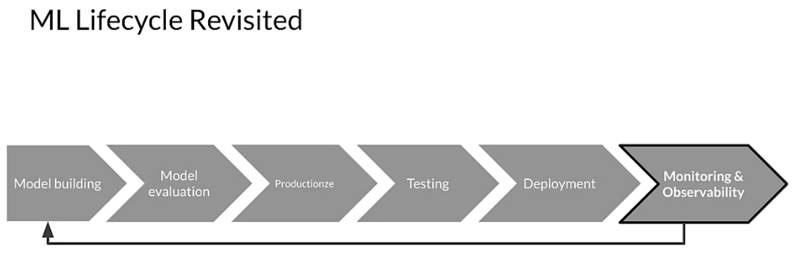
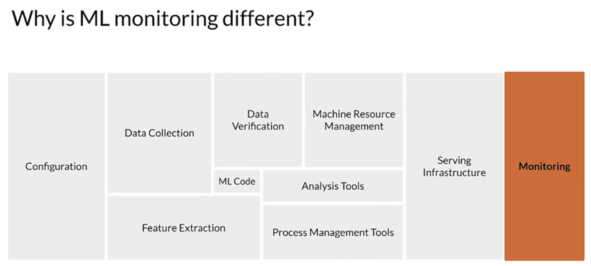

# Intersection of Machine Learning an DevOps

An ounce of prevention is worth a pound of cure - Benjamin Franklin

## Model Monitoring

The last task monitoring your model in production is an ongoing task for as long as your model is in production. 
The data that you gather by monitoring will guide the building of the next version of your model and make you aware of changes in your model performance. 
So, as you can see here, this is a cyclical iterative process which requires the last step monitoring in order to be complete.

## Monitoring 
1. directly related to your model performance. 
2. also need to include monitoring of the systems and infrastructure which are included in your entire product or service such as databases and web servers. 
   1. That kind of monitoring is only concerned with the basic operation of your product or service and not the model itself, but is critical to your users experience. 
   2. Basically, if the system is down, it really doesn't matter how good your model is.

## What to monitor?
1. Immediate Data Skews
   1. if your training data is too old, even when you first deploy a new model, it can have immediate data skews.
2. Model Staleness
   1. Environment Shifts
      1. models will also become stale or inaccurate because the world constantly changes and the training data you originally collected might no longer reflect the current state. 
         1. without monitoring you are unlikely to be aware of the problem. 
   2. Consumer Behavior
   3. Adversarial Scenarios 
   4. Negative Feedback Loops
      1. If this data is biased or corrupted in any way, then the models trained on that data will perform poorly. 

Monitoring is important even for automated processes because they too can have problems.

### ML "Functional" Monitoring
1. Predictive Performance
2. Changes in Serving Data
3. Metrics used during training
4. Characteristics of Features

### System "non-Functional" Monitoring
1. System Performance
2. System Status
3. System Reliability

### What's different from tradition SW?

Unlike a pure software system, there are two additional components to consider in an ML system, the data and the model. Unlike in traditional software systems, the accuracy of an ML system depends on how well the model reflects the world it is meant to model which in turn depends on the data used for training and on the data that it receives while serving requests. It's not simply a matter of monitoring for system failures like SEG faults and out of memory or network issues, the model and the data require additional, very specialized monitoring as well.

Code and config also take on additional complexity and sensitivity in an ML system due to two aspects, entanglement and configuration
1. Entanglement 
   1. refers to the issue where changing anything, changes everything
   2. be careful with feature engineering and features selection and understand your model sensitivity
2. Confogiration
   1. model hyper parameters, versions and features are often controlled in a system config and the slightest error here can cause radically different model behavior that won't be picked up with traditional software tests.