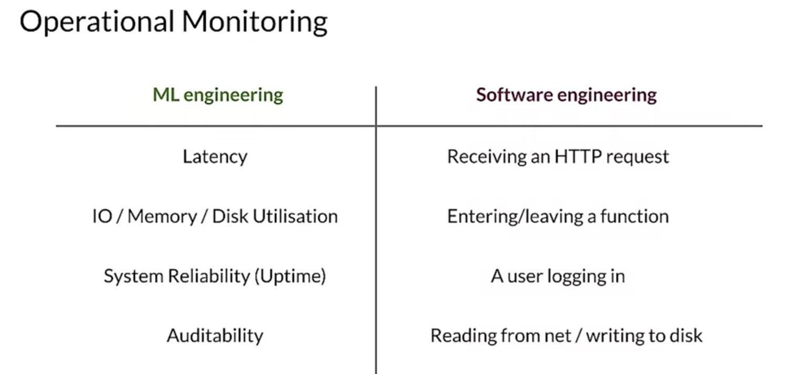

# Monitoring Targets

1. Model input distribution
   1. The inputs in a deployed system are the prediction requests, each of which is a feature vector. You can use statistical measures of each feature, including their distributions and look for changes that may be associated with failures. 
2. Model output distributions
   1. The outputs are the model's predictions which you can also monitor and measure. This should include an understanding of the deployment of different model versions to help you understand how different versions perform. You should also consider performing correlation analysis to understand how changes in your inputs affect your model outputs. 
   2. And again, this should be done on slices of your data, for example, correlation analysis can help you detect how seemingly harmless changes in your inputs cause prediction failures.
3. Prediction Requests
   1. You should monitor for errors such as values falling outside and allowed range or a set of categories where these air conditions are often defined based on domain knowledge.
4. Feature Distributions
   1. You should also monitor how each feature distribution changes over time and compare those to the training data, monitoring for errors and changes is better done with sliced data so that you can better understand and identify potential system failures.
5. Statistical Testings
   1. Statistical testing and comparisons are the basic tools that you can use to analyze your data. Typical descriptive statistics include median mean standard deviation and range values for monitoring model predictions.

It's also important to consider that if you have altered the distributions of the training data to correct for things like class imbalance or fairness issues. Then you need to take that into account when comparing to the distributions of the input data that gathered through that is gathered through the monitoring prediction requests

## how does this compare to SW?
- the operational concerns around our ml system may include monitoring system performance in terms of measures like latency or IO and memory or disk utilization or system reliability in terms of up time and monitoring can even happen while taking audit ability into account.
- In software engineering, talking about monitoring is strictly speaking, talking about events, events can be almost anything ranging from receiving an http request entering or leaving a function which may or may not contain ml code or not. A user logging in reading from network or writing to the disk and so on

Having all of the context for all of the events would be great for debugging and understanding how your systems perform in both technical and business terms. But collecting all the context information is often not practical, as the amount of data to process and store could be very large, so it's important to understand the most relevant context and try to gather that information.