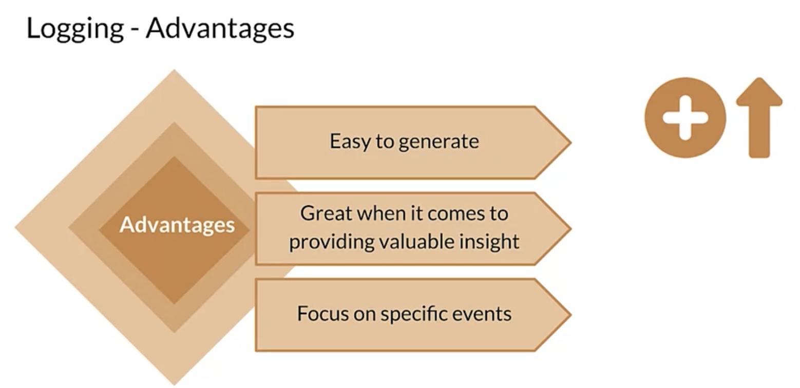
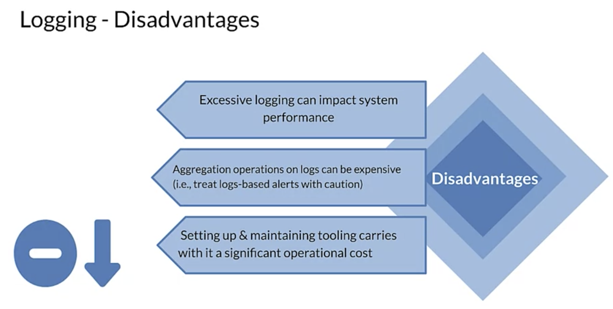

# Logging

Logging is almost always the basis for collecting the data that you will use to monitor your models and systems.

What is a log? A log is an immutable time stamped record of discrete events that happened over time for your ML system along with additional information. 

Cloud monitoring collects metrics from all of the cloud services by default which you can then use to build dashboards. When you need additional application or business level metrics. You can use those custom metrics to monitor over time.

Then using aggregate sinks and workspaces allows you to centralize your logs from many different sources or services in order to create a unified view of your application.

Cloud providers also offer managed services for logging of cloud based distributed services. These include google cloud monitoring, Amazon, Aloudwatch and as your monitor as well as several managed offerings from 3rd parties.

Log messages are very easy to generate since it is just a string, a blob of JSON or typed key value pairs. Event logs provide valuable insight along with context providing detail that averages and percentiles don't surface. 

While metrics show the trends of a service or an application, logs focus on specific events. This includes both log messages printed from your application as well as warnings, errors or debug messages which are generated automatically.

On the processing side, raw logs are almost always normalized, filtered and processed by a tool like log stash or fluent D or scribe or eca. Before there persisted in a data store like elastic search or big query. 
- Setting up and maintaining this tooling carries with it a significant operational cost. One of the key advantages of managed services is that they remove this cost. 

## Advantages

## Disadvantages

## Red Flags
Some of the red flags to watch out for may include basic things like 
1. a feature becoming unavailable. 
   1. Especially when you're including historical data in your prediction requests which needs to be retrieved from a data store. 
2. notable shifts in the distribution of key input values are important. 
   1. For example, a categorical value that was relatively rare in the training data becomes more common. 
3. pattern specific to your model 
   1. for example, in an NLP scenario, a sudden rise in the number of words not seen in the training data. That can also be another sign of a potential change which can lead to problems. 

# Log Storage
- you should consider parsing out and storing your input and prediction data along with any labels that you're able to gather in aquariable data store. 
- Such as a database or a search engine based tool like elastic search. This enables analysis for things like generating the distributions and statistics of your features which can be tracked and compared over time.
- By associating each item with a time stamp you can also order the data which is important for identifying trends and seasonality.
- in a queryable offline data store, enables offline automated reporting dashboards and alerting

Log data is of course also the basis for your next training data set.

At the very least, collecting prediction requests should provide the feature vectors that are representative of the current state of the world that your application lives in. So this data is very valuable.

# New Training Data
At the very least, collecting prediction requests should provide the feature vectors that are representative of the current state of the world that your application lives in. So this data is very valuable.

1. direct labelling. For example for recommend systems you can usually capture the user behavior after a recommendation is made to determine if the right options were recommended.
2. manual labeling which can be slow and expensive but is also sometimes the only viable option
3. active learning can help reduce the cost by only selecting the most important examples to label. And that includes shaping your data set for issues like class imbalance and fairness.
4. weak supervision is a powerful technique with significant advantages but also some challenges. What's most important here is that you capture this valuable data so that you can keep your model in sync with a changing world.