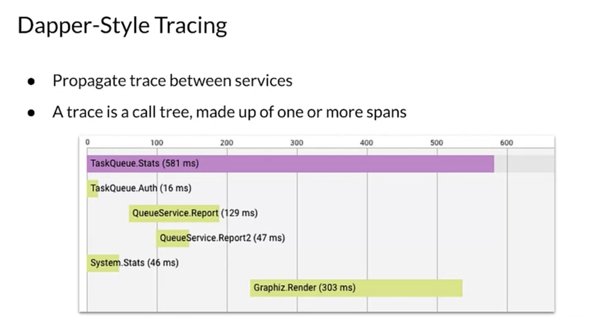

# Tracing

Tracing focuses on monitoring and understanding system performance, especially for microservice-based applications.

- Things get more interesting when considering distributed systems. Suppose you're trying to troubleshoot a prediction latency problem, suppose your system is made of many independent services and the prediction is generated through many downstream services, you have no idea which of those services are causing the slowdown. You have no clear understanding of whether it's a bug and integration issue, a bottleneck due to a poor choice of architecture or poor networking performance. 
- In monolithic systems, it's relatively easy to collect diagnostic data from different parts of a system. All the modules might even run within one process and share common resources for logging. 
- Solving this problem becomes even more difficult if your services are running as separate processes in a distributed system. You can't depend on the traditional approaches that help diagnose monolithic systems. 
  - You need to have finer grained visibility into what's going on inside each service and how they interact with one another over the lifetime of a user request.
  - It becomes harder to follow a call starting from the front-end web server to all of its back-ends until the prediction is returned back to the user and you'll notice here that we're really focusing on online serving.

## Tools

To properly inspect and debug issues with latency for requests in distributed systems, you need to understand the sequencing and parallelism of the services and the latency contribution of each to the final latency of the system. 
- To address this problem, Google developed the distributed tracing system, Dapper to instrument and analyze its production services. The Dapper paper has inspired many open source projects, such as Zipkin and Jaeger and Dapper style tracing has emerged as an industry wide standard. 
- Dapper style tracing works by propagating tracing data between services. Each service annotate the trace with additional data and passes the tracing header to other services until the final request completes. 
- Services are responsible for uploading their traces to a tracing back-end. The tracing back-end, then puts related latency data together like pieces of a puzzle.
- Tracing back-ends also provide UIs to analyze and visualize traces. Each trace is a call tree, beginning with the entry point of a request and ending with the server's response including all of the RPCs along the way. Each trace consists of small units called spans.