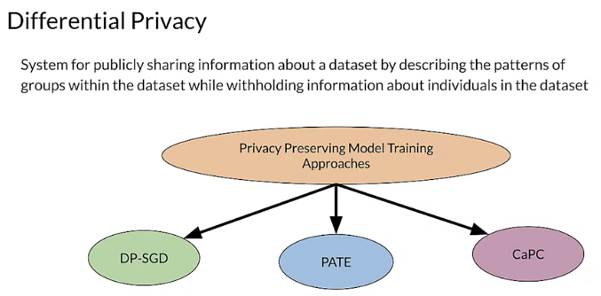
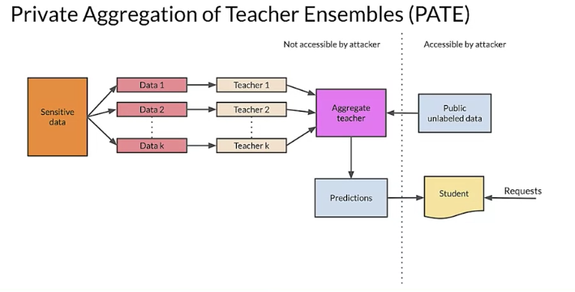

# Responsible AI

Development of AI creates new opportunities in industries

It also raises  questions about implementing responsible practices
1. Fairness
2. Interpretability
3. Privacy
4. Security

## Human-Centered Design
- Actual users' experience is essential
- Design features with appropriate  disclosures built-in
- Consider augmentation and assistance
  - offer multiple suggestions instead of one right answer
- Model potential adverse feedback early in design process
- Engage with diverse set of users and use  case scenarios

## Identify Multiple Metrics
- using several metrics helps you understand tradeoffs
- feddback from user surveys
- quantities that track performance (false-positive/negative rates across subgroups, click through, etc.)
- Metrics must be appropraite for the context and goals of your system
  - firealarm should have high recall, even  if it occassionally reports false alarm

## Analyze raw data carefully
- for sensitive raw data, respect privacy
- alternatives: compute aggregate, anonymized summaries
- does your data reflect your users
- imperfect proxy labels (relations between labels and actual targets)

# Legal Requirements for Secure and Private AI
- Training data, prediction requests, or both, can contain very sensitive information about people.
- Privacy of sensitive data should be protected. 

## What safeguards do you need to put in place to ensure the privacy of individuals considering that ML models may remember or reveal aspects of the data that they've been exposed to?
- In Europe, for example, you need to comply with the General Data Protection Regulations, or GDPR, and in California, you need to comply with the California Consumer Privacy Act, or CCPA. 
- The General Data Protection Regulation, or GDPR, was enacted by the EU in 2016 and became a model for many national laws outside the EU, including Chile, Japan, Brazil, South Korea, Argentina, and Kenya. 
- It regulates the data protection and privacy in the European Union and the European Economic Area. 
- The GDPR gives individuals control over their personal data and requires that companies should protect the data of employees and consumers. 
- When data processing is based on consent, the data subject, usually an individual person, has the right to revoke their consent at any time. 
- In California, Consumer Privacy Act, or CCPA, was modeled after the GDPR and has similar goals, including enhancing the privacy rights and consumer protections for residents of California.  When data processing is based on consent, the data subject, usually an individual person, has the right to revoke their consent at any time. In California, Consumer Privacy Act, or CCPA, was modeled after the GDPR and has similar goals, including enhancing the privacy rights and consumer protections for residents of California. 
- It states that users have the right to know what personal data is being collected about them, including whether the personal data is sold or disclosed in some way, who supplied their data and who received their data. 

## Informational Harms
- Security and privacy are closely linked for some problems or harms and machine learning.

There are at least three different types of informational harms, including 
- membership inference, where an attacker can determine whether or not an individual's data was included in the training set. 
- Model inversion, where the attackers actually able to recreate the training set
- model extraction, where an attacker is able to recreate the model itself.

- Behavioral harms are caused when an attacker is able to change the behavior of the model itself. 
  - This includes poisoning attacks, where the attacker is able to insert malicious data into the training set, and 
  - evasion attacks where the attacker makes small changes to prediction requests to cause the model to make bad predictions. 

## Defending against attacks
Secure Multi-Party Computation, or SMPC, or Fully Homomorphic Encryption, or FHE, when training and serving your models. 
1. SMPC enables multiple systems to collaborate securely to train and/or serve a model while keeping the actual data secure through the use of shared secrets.
2. FHE, on the other hand, enables developers to train their models on encrypted data without decrypting it first. 
   1. allows users to send an encrypted prediction requests and receive back an encrypted results. During the entire process, the data is never decrypted except by the user. 
   2. FHE is very computationally expensive.
3. using cryptography, you can protect the confidentiality of your training data.
4. Roughly, a model is differentially private if an attacker seeing its predictions cannot tell if a particular user's information was included in the training data.
5. Differentially-Private Stochastic Gradient Descent , or DP-SGD, 
   1. If an attacker is able to get a copy of a normally trained model, then they can use the weights to extract private information.
   2. DP-SGD, eliminates that possibility by applying differential privacy throughout training. 
      1. It does that by modifying the minibatch stochastic optimization process by adding noise. The result is a trained model which retains differential privacy because of the post-processing immunity property of differential privacy.
         1. Post-processing immunity is a fundamental property of differential privacy. It means that regardless of how you process the models predictions, you can't affect their privacy guarantees.
         2. 
6. Private Aggregation of Teacher Ensembles or PATE, and 
   1. PATE begins by dividing up sensitive data into k partitions with no overlaps. It then trains k models on that data separately as teacher models, and then aggregates the results in an aggregate teacher model.
   2. This is the same teacher-student used for knowledge distillation.
   3. During the aggregation for the aggregate teacher, you will add noise to the output in a way that won't affect the resulting predictions
   4. For deployment, you will create a student model. To train the student model, you'll take unlabeled public data and feed it to the aggregate teacher model. 
   5. The output of this process is labeled data, which maintains privacy. 
      1. After training, you will discard everything on the left side of this diagram and deploy only the student model for use. 
      2. 
7. Confidential and Private Collaborative learning, or CaPC. 
   1. enables multiple developers using different data to collaborate to improve their model accuracy without sharing information. 
   2. it applies techniques and principles from both cryptography and differential privacy.
   3. includes using Homomorphic Encryption, or HE, to encrypt the prediction requests that each collaborating model receives so that information in the prediction request is not leaked.
   4. It then uses PATE to add noise to the predictions from each of the collaborating models and uses voting to arrive at a final prediction, again, without leaking information. 
   5. Example
      1. A great example of how CaPC can be used is to consider a group of hospitals who want to collaborate to improve each other's models and predictions. Because of healthcare privacy laws, they can't share information directly. But using CaPC, they can achieve better results while preserving the privacy and confidentiality of their patients.

# Anonymization and Pseudonymisation

- GDPR - the GDP are includes many regulations to preserve privacy of user data and includes the definitions of many of the terms that it uses.
  - Anonymization removes personally identifiable information or P II from data sets so that people who the data describes remain anonymous for the GDPR
    - Recital 26 defines acceptable data anonymous station to be irreversible and done in such a way that is impossible to identify the person.
      - It's impossible to derive insights or discrete information even by the party responsible for anonymization.
  - Pseudonymisation is a bit different. This is a reversible process, meaning that it's still possible to identify the individual if the right additional information is included.
    - Pseudonymisation can be implemented with data masking or encryption or tokenization. It relies on careful control of access to the additional identifying information. 
  - to to be clear the biggest difference between anonymization and pseudonymisation is that pseudonymized data can be reversed using an additional set of information or an encryption key while anonymization is irreversible.
- personally identifiable data contains name, address, phone, email etc. 
- pseudonymized and de identified data form the intermediary category of the spectrum.

## So what part of your data should you anonymized?
- basically everything that is part of PI that includes any data that reveals the identity of a person which are known as identifiers and with the term identifiers.
  - any natural or legal person living or dead including their dependents, their ascendance and descendants. This also includes other related persons who might be identifiable through either direct or indirect relationships. For example, this includes features such as family names, patron names first names, maiden names, aliases, address phone, bank account details, credit cards, tax IEDs and so forth.

# Right to be forgotten
When the GDPR refers to a data subject, it means a person, and when it refers to a controller, it means a person or organization who has control over a dataset containing Personally Identifiable Information or PII. 

## When does a person have the right to be forgotten? 
- The list includes the personal data is no longer necessary for the purpose an organization originally collected it or processed it,
- or an organization is relying on individual's consent as the lawful basis for processing the data and that individual withdraws their consent,
- or an organization is relying on legitimate interests as its justification for processing an individual's data and the individual objects to this processing, and there is no overriding legitimate interest for the organization to continue with the processing,
- or an organization is processing personal data for direct marketing purposes and the individual objects to this processing
- or an organization processed an individual's personal data unlawfully
- or an organization must erase personal data in order to comply with a legal ruling or obligation
- or an organization has processed a child's personal data to offer them information society services an information society might be a social network, for example.
If any of those conditions are met, you must delete the person's data. 

Here are the reasons cited in the GDPR that override the right to be forgotten
- The data is being used to exercise the right of freedom of expression and information
- or the data is being used to comply was a legal ruling or obligation
- or the data is being used to perform a task that is being carried out in the public interest or when exercising an organization's official authority
- or the data being processed is necessary for public health purposes and serves in the public interest
- or the data being processed is necessary to perform a preventative or occupational medicine, this only applies when the data is being processed by a health professional who is subject to a legal obligation of professional secrecy
- or the data represents important information that serves the public interest, scientific research, historical research, or statistical purposes where the eraser of the data would be likely to impair or halt progress towards the achievement that was the goal of the processing
- or the data is being used for the establishment of a legal defense or in the exercise of other legal claims
When in doubt err on the side of privacy.

- You also have the right to have your personal information corrected or rectified. This might be important in situations like your credit history, health history, or employment history.

When you receive a valid request to have personal information deleted, you need to identify all of the information related to the content requested to be removed, you also need to identify and remove all of the metadata associated with that person. If you've run any analysis or trained any models, the derived data and logs, and models must also be removed or corrected.

There are basically two ways to delete data which will satisfy the requirements of the GDPR
1. First, you can anonymize the data, which as you saw previously, will make it non personally identifiable under the terms of the GDPR, and the GDPR will no longer apply to anonymize data.
2. you can do a hard delete of the data, meaning actually delete the data, including any rows in your database which might contain it.

Normally, your first impulse might be to always just do a hard delete, but often there are issues with that. Anonymization is another option. In a database or any other similar relational datastore, deleting records can cause havoc. 
For example, it can break foreign keys. On the other hand, anonymization keeps the records and only anonymizes the fields containing PII while still satisfying the requirements of the GDPR. 

 in order to enforce the GDPR, several organizational changes are needed, including policy changes and training employees in how to enforce the right to be forgotten, and one last consideration, that can be tricky; if your organization maintains multiple backups of your data, which actually you should, making sure that your personal data has been deleted from all of your backups is challenging. You might very well have to change your data storage and backup implementation to maintain compliance with a GDPR.